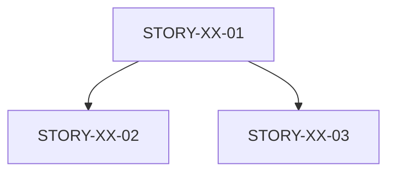

# Step 04: Validate and Update Tracking

> Purpose: Final validation of created stories and update TRACKING.md.

---

## MANDATORY RULES (READ FIRST)

- ✅ VERIFY all story files exist and are complete
- 📊 UPDATE TRACKING.md with new stories
- 📋 REPORT summary to user
- 🔍 CHECK for any remaining issues

## PROTOCOLS

- 🎯 **Goal**: Complete validation and tracking update
- 💾 **Output**: Updated TRACKING.md, final summary
- 📖 **Reference**: Epic's TRACKING.md file
- ⚡ **Performance**: Final quality gate

---

## CONTEXT

**Available from previous steps:**
- `{epic_id}` - Epic identifier (from step-00)
- `{epic_path}` - Path to Epic file (from step-00)
- `{approved_stories}` - User-validated stories (from step-02)
- `{stories_created}` - Created story files (from step-03)
- `{file_conflicts}` - Detected conflicts (from step-02)
- `{generation_errors}` - Any creation errors (from step-03)

**Produced by this step:**
- `{validation_result}` - Final validation status
- Updated TRACKING.md file

---

## TASK

Validate all created stories and update Epic tracking.

---

## EXECUTION

### 1. Verify Created Files

For each story in `{stories_created}`:

```
Read {story.path}
```

**Check for:**
- File exists and is readable
- All required sections present
- No placeholder text ({{...}})
- Gherkin syntax valid
- Story points assigned
- Technical tasks listed

### 2. Run Validation Checklist

```yaml
validation_result:
  stories_validated: X
  stories_with_issues: Y
  issues:
    - story_id: "STORY-XX-02"
      issue: "Missing AC-2 Gherkin scenario"
      severity: "LOW"
      fix: "Can be added during implementation"
```

**Severity levels:**
- **CRITICAL**: Story cannot be implemented (missing AC, wrong format)
- **HIGH**: Major issue that should be fixed (incomplete tasks)
- **MEDIUM**: Quality concern (vague language)
- **LOW**: Polish item (minor formatting)

### 3. Update TRACKING.md

Locate or create TRACKING.md:

```
docs/epics/{epic_id}-{name}/TRACKING.md
```

**Add stories to tracking:**

```markdown
## Stories

| ID | Titre | Points | Status | Assignee |
|----|-------|--------|--------|----------|
| STORY-XX-01 | ... | 3 | A faire | - |
| STORY-XX-02 | ... | 5 | A faire | - |
| STORY-XX-03 | ... | 8 | A faire | - |

**Total**: XX points
**Created**: YYYY-MM-DD

### Story Dependencies



### File Conflicts

| File | Stories | Resolution |
|------|---------|------------|
| lib/x.dart | 01, 02 | Sequential |
```

### 4. Generate Summary

Prepare final summary for user:

```markdown
## /create-story Complete

**Epic**: {epic_id}
**Stories Created**: X
**Total Points**: Y

### Stories

| ID | Titre | Points |
|----|-------|--------|
| ... | ... | ... |

### Conflicts Documented

- [List of conflicts and resolutions]

### Next Steps

1. Review stories in docs/epics/{epic_id}/stories/
2. Assign stories to developers
3. Use /dev-story to implement each story
4. Track progress in TRACKING.md

### Issues (if any)

- [List of validation issues]
```

### 5. Present Summary

Display the summary to user. Workflow is complete.

---

## AUTO-VALIDATION

**Before completing, validate:**
✅ All story files verified
✅ TRACKING.md updated
✅ Summary prepared
✅ Any errors documented

**Self-Critique Questions:**
- Did I verify EVERY created file?
- Is the TRACKING.md update complete?
- Are the dependencies correctly documented?
- Would someone new understand the summary?

**If validation fails:**
1. Fix minor issues inline
2. Document unfixable issues
3. Present summary with caveats

---

## SUCCESS / FAILURE

**Success:**
✅ All stories validated
✅ TRACKING.md updated
✅ Summary presented to user
✅ Workflow complete

**Failure modes:**
❌ TRACKING.md not found → Create new TRACKING.md
❌ Validation issues found → Document in summary, continue
❌ Files corrupted → Report error, suggest manual check
❌ Cannot update tracking → Present summary, note issue

## WORKFLOW COMPLETE

After this step, the workflow is finished.

Present the summary and inform user that stories are ready for /dev-story.

<critical>
This is the FINAL step.
Ensure user receives a clear summary of what was created.
Document any issues that need manual attention.
Stories are now ready for implementation via /dev-story.
</critical>
