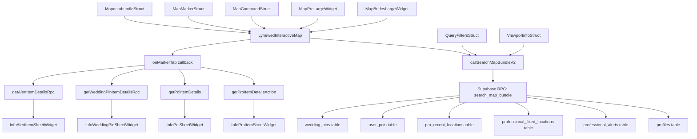

# Audit Complet - Fonctionnalité Map

**Date:** 2025-11-27 (Validation complète)  
**Version précédente:** 2025-11-26  
**Scope:** Map feature for brides and pros to view location markers  
**Projet:** Lynewed Mobile App v1.1.1+59  
**Environnement:** Développement (hekyovgnovhfhmkpfrna)  
**Statut:** ✅ **VALIDÉ POUR REFACTORISATION** - Voir `MAP_REFACTORING_PLAN.md` v1.6

---

## ⚠️ RÉSUMÉ EXÉCUTIF - PROBLÈMES CRITIQUES

### Problèmes Majeurs Identifiés

| Priorité | Problème | Impact | Section |
|----------|----------|--------|---------|
| 🔴 CRITIQUE | **MapMarkerType incohérent** - 8 valeurs dont certaines redondantes ou inutilisées | Confusion code, maintenance difficile | §10.1 |
| 🔴 CRITIQUE | **professional vs fixedLocation** - Même concept, logiques différentes | Duplication de code, incohérence UX | §10.2 |
| 🔴 CRITIQUE | **proRecent non implémenté** - Enum présent mais feature non active | Code mort, confusion | §10.3 |
| 🟠 MAJEUR | **POI privé vs WeddingPin** - Logique confuse et incohérente | UX confuse pour les brides | §10.4 |
| 🟠 MAJEUR | **searchTarget affiché sur map** - Devrait être navigation-only | Pollution visuelle | §10.5 |
| 🟠 MAJEUR | **user enum inutilisé** - Aucune utilisation réelle | Code mort | §10.6 |
| 🟡 MOYEN | **Structs FlutterFlow verbeux** - Code généré non optimisé | Maintenance difficile | §10.7 |
| 🟡 MOYEN | **WeddingPinItemDataStruct** - Champs poiId et source inutilisés | Confusion, dette technique | §10.8 |

---

## 📊 RÉSULTATS VALIDATION (2025-11-27)

### Audit Supabase MCP - État Réel
| Table | Records | État | Action requise |
|-------|---------|------|----------------|
| `wedding_pins` | 10 | ✅ Données réelles | Migrer vers `weddings` |
| `user_pois` | 0 | ✅ Vide | Supprimer |
| `professional_alerts` | 12 | ✅ Données | Migrer `motif_code`→`alert_type` |
| `professional_fixed_locations` | 0 | ❌ Vide | Seed data créé (12 records) |
| `pro_recent_locations` | 0+ | ⚠️ Non documentée | **SUPPRIMER** (décision prise) |

### Corrections Critiques Appliquées
1. **Enum subscriptionTierType**: `trial` (pas `free`) aligné avec Supabase
2. **Limites zoom**: Inversées (2000→50) pour correspondre au RPC actuel  
3. **connectionRequestSource**: Migration `weddingPin`→`wedding` planifiée
4. **Timeline révisée**: 60-75h (+30% réaliste, 55 fichiers impactés)

### Décisions Finales Prises
- **proRecent** → **SUPPRIMER** (localisation temps réel abandonnée)
- **motif_code** → **GARDER** pour compatibilité (migration progressive)
- **connectionRequestSource** → **MIGRER** pour cohérence Wedding

### Documents de Référence
- **Source de vérité implémentation**: `MAP_REFACTORING_PLAN.md` v1.6
- **Validation complète**: `archive/MAP_REFACTORING_VALIDATION_REPORT.md`
- **Pré-vol checklist**: `archive/MAP_REFACTORING_PREFLIGHT_CHECKLIST.md`

---

## Métadonnées
- **Fichiers Flutter map-spécifiques:** 22
- **Tables Supabase impliquées:** 6
- **Pages principales:** 2
- **Sheets information:** 6
- **Widgets custom map:** 4
- **Actions personnalisées map:** 8+
- **Composants filtres:** 3
- **Enums map identifiés:** 3
- **Fonctions RPC Supabase:** 30+

---

## 1. Inventaire Code Flutter

### 1.1 Pages

#### MapBridesLargeWidget
- **Chemin complet:** `/lib/pages/bride/map_brides_large/map_brides_large_widget.dart`
- **Rôle utilisateur:** Bride
- **Widgets map utilisés:** LynewedInteractiveMap
- **Actions/Services appelés:** 
  - `getProItemDetailsAction` (pour markers professional/fixedLocation/proRecent)
  - `getPoiItemDetails` (pour markers poiPrivate)
  - `getWeddingPinItemDetailsRpc` (pour markers weddingPin)
  - `getAlertItemDetailsRpc` (pour markers professionalAlert)
- **Conditions d'affichage:** Basées sur `FFAppState().currentUserRole` == bride

#### MapProLargeWidget
- **Chemin complet:** `/lib/pages/pro/map_pro_large/map_pro_large_widget.dart`
- **Rôle utilisateur:** Professional
- **Widgets map utilisés:** LynewedInteractiveMap
- **Actions/Services appelés:** Identiques à bride + `CreateEditAlertSheetWidget`
- **Conditions d'affichage:** Basées sur `FFAppState().currentUserRole` == professional

### 1.2 Components

#### LynewedInteractiveMap
- **Chemin complet:** `/lib/custom_code/widgets/lynewed_interactive_map.dart`
- **Props/Paramètres:** 
  - `width`, `height`: dimensions
  - `command`: MapCommandStruct pour contrôles
  - `filters`: QueryFiltersStruct pour filtrage
  - `userRole`: UserRole (bride/pro)
  - `markers`: List<MapMarkerStruct>
  - `onDataLoaded`: callback retour données
  - `onMarkerTap`: callback interaction
- **Events/Callbacks:** 
  - `onDataLoaded(MapdatabundleStruct)`
  - `onMarkerTap(MapMarkerStruct)`
- **Où utilisé:** MapBridesLargeWidget, MapProLargeWidget
- **Performance:** Clustering intégré, cache d'icônes, debounce 500ms

#### LynewedMiniMap
- **Chemin complet:** `/lib/custom_code/widgets/lynewed_mini_map.dart`
- **Props/Paramètres:** Non utilisé dans les pages principales
- **Usage:** Component auxiliaire (non actif dans flux principal)

### 1.3 Custom Actions

#### callSearchMapBundleV2
- **Chemin complet:** `/lib/custom_code/actions/call_search_map_bundle_v2.dart`
- **Input/Output:** 
  - Input: ViewportinfoStruct, QueryFiltersStruct, UserRole
  - Output: MapdatabundleStruct
- **Logique métier:** Appelle RPC Supabase `search_map_bundle` avec bounding box et filtres
- **Requêtes Supabase:** `client.rpc('search_map_bundle', params: params)`
- **Gestion erreurs:** Retourne bundle vide si erreur

#### getProItemDetailsAction
- **Chemin complet:** `/lib/custom_code/actions/get_pro_item_details_action.dart`
- **Input/Output:** String profileId → ProDetailsStruct
- **Logique métier:** Récupère détails complet d'un professionnel
- **Requêtes Supabase:** Tables profiles, professional_details, etc.

#### getPoiItemDetails
- **Chemin complet:** `/lib/custom_code/actions/get_poi_item_details.dart`
- **Input/Output:** String poiId → PoiItemDataStruct
- **Logique métier:** Récupère détails d'un point d'intérêt privé

#### getWeddingPinItemDetailsRpc
- **Chemin complet:** `/lib/custom_code/actions/get_wedding_pin_item_details_rpc.dart`
- **Input/Output:** String pinId → WeddingPinItemDataStruct
- **Logique métier:** Récupère détails d'une wedding pin

#### getAlertItemDetailsRpc
- **Chemin complet:** `/lib/custom_code/actions/get_alert_item_details_rpc.dart`
- **Input/Output:** String alertId → AlertItemDataStruct
- **Logique métier:** Récupère détails d'une alerte professionnelle

### 1.4 Custom Widgets

#### LynewedInteractiveMap (détails)
- **Chemin complet:** `/lib/custom_code/widgets/lynewed_interactive_map.dart`
- **Paramètres:** 15+ paramètres configurables
- **Stateless/Stateful:** StatefulWidget
- **Performance:** 
  - Cache d'icônes avec signature basée sur style
  - Clustering dynamique (minClusterSize: 6)
  - Debounce camera idle (500ms par défaut)
  - Projection Mercator pour clustering

### 1.5 Backend Schema

#### MapMarkerStruct
- **Chemin complet:** `/lib/backend/schema/structs/map_marker_struct.dart`
- **Champs:** 
  - `id`: String
  - `type`: MapMarkerType (enum)
  - `position`: LatLng
  - `styleInfo`: MarkerStyleInfoStruct
- **Sérialisation:** JSON avec enum serialization
- **Relations:** Utilisé dans MapdatabundleStruct

#### MapdatabundleStruct
- **Chemin complet:** `/lib/backend/schema/structs/mapdatabundle_struct.dart`
- **Champs:** 
  - `markers`: List<MapMarkerStruct>
  - `weddingPins`: List<WeddingPinOverlayStruct>
  - `debugStats`: String
- **Sérialisation:** JSON complet
- **Relations:** Retour par callSearchMapBundleV2

#### QueryFiltersStruct
- **Chemin complet:** `/lib/backend/schema/structs/query_filters_struct.dart`
- **Champs:** 
  - `currency`: String
  - `radiusKm`: double
  - `center`: LatLng?
  - `professions`: List<Profession>?
  - Toggles booléens: `showPros`, `showProRecent`, etc.
- **Sérialisation:** JSON
- **Relations:** Input pour callSearchMapBundleV2

#### ViewportinfoStruct
- **Chemin complet:** `/lib/backend/schema/structs/viewportinfo_struct.dart`
- **Champs:** 
  - `centerLat`, `centerLng`: double
  - `neLat`, `neLng`: double
  - `swLat`, `swLng`: double
  - `zoom`: double
- **Sérialisation:** JSON
- **Relations:** Input pour callSearchMapBundleV2

#### MapCommandStruct
- **Chemin complet:** `/lib/backend/schema/structs/map_command_struct.dart`
- **Champs:** 
  - `type`: MapActionType
  - `id`: String
  - `target`: LatLng?
  - `fitBoundsTo`: List<LatLng>?
- **Sérialisation:** JSON
- **Relations:** Contrôles interactifs map

### 1.6 Supabase Queries

#### callSearchMapBundleV2
- **Chemin complet:** `/lib/custom_code/actions/call_search_map_bundle_v2.dart`
- **Code de la requête:** `client.rpc('search_map_bundle', params: params)`
- **Paramètres input:** 
  - `p_bbox_coords`: bounding box viewport
  - `p_viewer_role`: bride/professional
  - `p_filters`: filtres toggles et professions
  - `p_zoom`: niveau zoom
- **Type de retour:** MapdatabundleStruct
- **Tables interrogées:** Via RPC: profiles, professional_alerts, professional_fixed_locations, pro_recent_locations, user_pois, wedding_pins

---

## 2. Architecture Backend Supabase Complète

### 2.1 Extensions PostGIS (50+) - Infrastructure Géospatiale
| Extension | Version | Rôle Géospatial Critique |
|---|---|---|
| **postgis** | 3.3.7 | Types geometry/geography, ST_Intersects(), ST_MakePoint() |
| **postgis_topology** | 3.3.7 | Topologie géospatiale (non utilisée) |
| **postgis_raster** | 3.3.7 | Support données raster (non utilisé) |
| **postgis_sfcgal** | 3.3.7 | Fonctions géométriques avancées |
| **pg_trgm** | 1.6 | Similarité texte pour recherche lieux (similarity()) |
| **address_standardizer** | 3.3.7 | Normalisation adresses automatique |
| **postgis_tiger_geocoder** | 3.3.7 | Géocodage adresses US (non utilisé) |
| **pgrouting** | 3.4.1 | Calculs de routage (réservé futur) |
| **pg_cron** | 1.6.4 | Jobs planifiés maintenance map (expire_alerts, cleanup) |
| **pg_net** | 0.19.5 | Appels HTTP pour APIs externes (géocodage) |
| **pg_graphql** | 1.5.11 | API GraphQL (réservé futur) |
| **pgaudit** | 17.1 | Audit logs sécurité (pgaudit.log) |
| **pgcrypto** | 1.3 | Cryptographie données sensibles |
| **pgjwt** | 0.2.0 | JWT tokens authentification |

### 2.2 Tables Géospatiales (6) - Schéma Complet
| Table | Colonne Geometry | Type Geometry | Index GiST | RLS Policies | Usage Map |
|---|---|---|---|---|---|
| **profiles** | location_coords | geometry(Point,4326) | ❌ (btree) | 5 policies | Position professionnelle live |
| **professional_alerts** | location_coords | geometry(Point,4326) | ✅ professional_alerts_location_coords_idx | 2 policies | Alertes professionnelles temporaires |
| **professional_fixed_locations** | location_coords | geometry(Point,4326) | ✅ professional_fixed_locations_location_coords_idx | 2 policies | Locations fixes professionnelles |
| **pro_recent_locations** | coords_approx | geometry(Point,4326) | ✅ pro_recent_locations_coords_approx_idx | 2 policies | Positions récentes (opt-in) |
| **user_pois** | coords | geometry(Point,4326) | ✅ user_pois_coords_idx | 1 policy | POIs privés brides |
| **wedding_pins** | location_coords | geometry(Point,4326) | ✅ wedding_pins_location_coords_idx | 2 policies | Pins mariage (budget/professions) |

### 2.3 Index Spécialisés (20) - Performance Optimisée
| Index | Table | Type | Logique | Impact Performance |
|---|---|---|---|---|
| **professional_alerts_location_coords_idx** | professional_alerts | GiST | Spatial sur location_coords | ⚡⚡ ST_Intersects() ultra-rapide |
| **professional_fixed_locations_location_coords_idx** | professional_fixed_locations | GiST | Spatial sur location_coords | ⚡⚡ Recherche locations fixes |
| **pro_recent_locations_coords_approx_idx** | pro_recent_locations | GiST | Spatial sur coords_approx | ⚡⚡ Positions récentes optimisées |
| **user_pois_coords_idx** | user_pois | GiST | Spatial sur coords | ⚡⚡ Recherche POIs privés |
| **wedding_pins_location_coords_idx** | wedding_pins | GiST | Spatial sur location_coords | ⚡⚡ Filtres mariage complexes |
| **idx_alerts_active_not_deleted** | professional_alerts | B-tree partial | status='active' AND is_deleted=false | ⚡ Alertes actives uniquement |
| **idx_alerts_expires_active** | professional_alerts | B-tree partial | expires_at WHERE status='active' | ⚡ Filtrage temporel alertes |
| **idx_prof_alerts_status_expires** | professional_alerts | B-tree | status, expires_at | ⚡ Tri temporel optimisé |
| **idx_rl_last_seen_optin** | pro_recent_locations | B-tree partial | last_seen_at DESC WHERE is_opt_in=true | ⚡ Positions récentes visibles |
| **idx_pro_recent_optin_lastseen** | pro_recent_locations | B-tree | is_opt_in, last_seen_at DESC | ⚡ Opt-in + temporal |
| **idx_wp_active_visible** | wedding_pins | B-tree partial | created_at WHERE is_deleted=false AND is_active=true | ⚡ Pins mariage actifs |
| **idx_poi_bride_created** | user_pois | B-tree | bride_profile_id, created_at | ⚡ POIs par bride chronologiques |

### 2.4 Triggers Métier (16) - Logique Automatisée
| Trigger | Table | Timing | Code Source | Rôle Critique Map |
|---|---|---|---|---|
| **alerts_rate_limit_before_insert** | professional_alerts | BEFORE | `IF cnt >= 3 THEN RAISE EXCEPTION 'ALERTS_RATE_LIMIT_REACHED'` | 🛡️ **Anti-spam**: Max 3 alertes/jour par pro |
| **set_professional_alert_expiry** | professional_alerts | BEFORE | Auto-calcul expires_at depuis duration_hours | ⏰ **Auto-expiry**: Fermeture automatique alertes |
| **wedding_pins_set_budget_eur** | wedding_pins | BEFORE | `NEW.budget_min_eur := public.convert_to_eur(NEW.budget_min::numeric, NEW.currency)` | 💰 **Conversion devise**: Normalisation budget EUR |
| **user_pois_history_logger** | user_pois | AFTER | Audit trail INSERT/UPDATE/DELETE | 📋 **Historique complet**: Traçabilité modifications POI |
| **wedding_pins_history_logger** | wedding_pins | AFTER | Audit trail INSERT/UPDATE/DELETE | 📋 **Historique pins**: Traçabilité wedding pins |
| **auto_populate_fixed_location_country_code** | professional_fixed_locations | BEFORE | Géocodage automatique pays depuis coords | 🌍 **Géocodage auto**: Enrichissement localisation |
| **trigger_move_first_fixed_after_insert** | professional_fixed_locations | AFTER | Migration première location vers principale | 🔄 **Smart migration**: Gestion locations multiples |
| **trg_profiles_set_updated_at** | profiles | BEFORE | `NEW.updated_at = now()` | ⏰ **Timestamp auto**: Mise à jour automatique |
| **trg_wedding_pins_set_updated_at** | wedding_pins | BEFORE | `NEW.updated_at = now()` | ⏰ **Timestamp auto**: Pins synchronisés |

### 2.5 Fonctions RPC Map (30+) - API Complète
#### RPC Principales Map
| RPC | Paramètres Complets | Code Logique | Retour | Usage Flutter |
|---|---|---|---|---|
| **search_map_bundle** | p_bbox_coords, p_filters, p_zoom | **6 requêtes spatiales optimisées**: 1) Pros live avec filtres budget/profession 2) Fixed locations 3) Pro recent (opt-in + 7 jours) 4) Alerts (pros only) 5) Wedding pins (subscription tiers) 6) POIs privés (brides only) **Limites dynamiques**: 2000→50 markers par zoom **Debug timing**: ms par requête | jsonb {markers[], overlays[], debugStats} | ⭐ **Core map data** - appelé sur chaque camera idle |
| **create_professional_alert** | p_motif_code, p_message, p_end_at, p_lat, p_lng, p_location_label | **Validation**: auth.uid() requis, end_at > now **Calcul durée**: `CEIL(EXTRACT(EPOCH FROM (p_end_at - now())) / 3600.0)` **Géométrie**: `ST_SetSRID(ST_MakePoint(p_lng, p_lat), 4326)` **Radius par défaut**: 100 km **Truncate message**: 150 caractères | uuid alert_id | 📢 **Création alerte** - CreateEditAlertSheetWidget |
| **insert_user_poi** | p_label, p_lat, p_lng, p_radius_km, p_professions[], p_budget_min, p_budget_max, p_currency, p_event_start_date, p_event_end_date, p_location_label | **Validation**: auth.uid() requis **Budget normalisation**: >=100000 → NULL (no upper bound) **Cast professions**: `ARRAY(SELECT unnest(p_professions)::public.profession)` **Géométrie**: `ST_SetSRID(ST_MakePoint(p_lng, p_lat), 4326)` | uuid poi_id | 📍 **Création POI** - CreateEditPointOfInterestSheetWidget |

#### RPC Gestion et Maintenance
| RPC | Rôle | Logique Métier | Usage |
|---|---|---|---|
| **cancel_professional_alert** | Annulation alerte | `UPDATE professional_alerts SET status='cancelled' WHERE id=p_alert_id AND author_profile_id=auth.uid()` | InfoAlertItemSheetWidget |
| **delete_user_poi** | Suppression POI | `DELETE FROM user_pois WHERE id=p_poi_id AND bride_profile_id=auth.uid()` | PointsOfInterestSheetWidget |
| **delete_wedding_pin** | Suppression pin | `UPDATE wedding_pins SET is_deleted=true WHERE id=p_pin_id AND bride_profile_id=auth.uid()` | InfoWeddingPinSheetWidget |
| **get_alert_item_details** | Détails alerte | Jointure profiles + professional_alerts avec author info | InfoAlertItemSheetWidget |
| **get_wedding_pin_item_details** | Détails pin | Jointure profiles + wedding_pins avec bride info | InfoWeddingPinSheetWidget |
| **insert_wedding_pin** | Création pin | Validation budget + professions + géométrie | CreateWeddingPinFlow |
| **geocode_city_to_point** | Géocodage villes | Conversion nom ville → geometry(Point,4326) | Recherche lieux |

#### RPC Jobs CRON (Maintenance Automatisée)
| RPC | Schedule | Logique | Impact Map |
|---|---|---|---|
| **expire_alerts** | pg_cron quotidien | `UPDATE professional_alerts SET status='expired' WHERE expires_at < now()` | 🧹 **Nettoyage alertes expirées** |
| **send_alert_reminders** | pg_cron horaire | Notifications alertes actives bientôt expirées | 📬 **Rappels utilisateurs** |
| **cleanup_pro_recent_locations** | pg_cron hebdomadaire | `DELETE FROM pro_recent_locations WHERE last_seen_at < now() - interval '7 days'` | � **Positions obsolètes** |

### 2.6 Politiques RLS (13) - Sécurité Multi-Couches
| Policy | Table | Rôle | Code Exact | Logique Métier |
|---|---|---|---|---|
| **Allow public read for opted-in recent locations** | pro_recent_locations | authenticated | `is_opt_in = true AND last_seen_at >= (now() - '7 days'::interval)` | 🔐 **Consentement explicite**: Positions récentes visibles seulement si opt-in ET < 7 jours |
| **Allow professionals to view alerts** | professional_alerts | authenticated | `get_my_role() = 'professional'::"userRole"` | 👥 **Professionals only**: Seuls les pros voient les alertes |
| **Professionals can view active wedding pins** | wedding_pins | authenticated | `is_deleted = false AND is_active = true AND (event_end_date IS NULL OR event_end_date >= CURRENT_DATE) AND ((bride_profile_id = auth.uid()) OR ((get_my_role() = 'professional'::"userRole") AND (get_my_tier() = ANY (ARRAY['premiumVisibility'::"subscriptionTierType", 'ultimateAccess'::"subscriptionTierType"]))))` | 💰 **Subscription tiers**: Wedding pins visibles seulement pour pros premium/ultimate |
| **Owner can manage their own pins** | wedding_pins | authenticated | `bride_profile_id = auth.uid()` | 👰 **Propriétaire bride**: Gestion complète de ses propres pins |
| **Owner can manage their own POIs** | user_pois | authenticated | `bride_profile_id = auth.uid()` | 👰 **Propriétaire bride**: Gestion complète de ses POIs privés |
| **Authenticated users can view fixed locations** | professional_fixed_locations | authenticated | `true` | 🌍 **Lecture publique**: Locations fixes visibles par tous les authentifiés |
| **Allow owner to manage their recent location setting** | pro_recent_locations | authenticated | `profile_id = auth.uid()` | ⚙️ **Contrôle opt-in**: Gestion paramètre visibilité position |
| **Allow author to manage their alerts** | professional_alerts | authenticated | `author_profile_id = auth.uid()` | 📢 **Auteur alerte**: Gestion complète de ses alertes |
| **Allow owner to manage their fixed locations** | professional_fixed_locations | authenticated | `professional_profile_id = auth.uid()` | 🏢 **Propriétaire pro**: Gestion locations fixes |
| **Public can view profiles linked to published wed_articles** | profiles | public | `EXISTS (SELECT 1 FROM wed_articles wa WHERE (wa.linked_pro_profile_id = profiles.id AND wa.is_published = true))` | 📰 **Articles publiés**: Profils visibles seulement si articles publiés |
| **Public profiles are viewable by authenticated users** | profiles | authenticated | `true` | 👥 **Profils publics**: Lecture autorisée pour tous authentifiés |
| **Allow owner to update their profile** | profiles | authenticated | `id = auth.uid()` | 👤 **Mise à jour soi-même**: Modification profil uniquement |
| **profiles_insert_self_only** | profiles | authenticated | Pas de qualification (INSERT limité) | 🔒 **Insertion contrôlée**: Auto-limité via auth.uid() |

### 2.7 Contraintes CHECK (8) - Validation Métier

| Contrainte | Table | Code Exact | Rôle Validation Map |
|---|---|---|---|
| **professional_alerts_duration_hours_check** | professional_alerts | `CHECK ((duration_hours >= 1) AND (duration_hours <= 720))` | ⏰ **Durée max**: 1h à 30 jours (720h) par alerte |
| **professional_alerts_message_check** | professional_alerts | `CHECK ((char_length(message) >= 3) AND (char_length(message) <= 2000))` | 📝 **Message**: 3-2000 caractères (tronqué à 150 dans RPC) |
| **professional_alerts_radius_km_check** | professional_alerts | `CHECK ((radius_km >= 1) AND (radius_km <= 100))` | 📏 **Rayon flexible**: 1-100 km (vs preset pour POIs) |
| **professional_alerts_title_check** | professional_alerts | `CHECK ((char_length(title) >= 3) AND (char_length(title) <= 120))` | 📝 **Titre**: 3-120 caractères |
| **user_poi_dates_chk** | user_pois | `CHECK ((event_end_date IS NULL) OR (event_start_date IS NULL) OR (event_end_date >= event_start_date))` | 📅 **Validation dates**: Fin >= Début |
| **user_poi_radius_chk** | user_pois | `CHECK ((radius_km IS NULL) OR (radius_km = ANY (ARRAY[5, 10, 20, 50, 100])))` | 📏 **Rayon preset**: Options fixes 5/10/20/50/100 km |
| **wedding_pin_dates_chk** | wedding_pins | `CHECK ((event_end_date IS NULL) OR (event_start_date IS NULL) OR (event_end_date >= event_start_date))` | 📅 **Validation dates**: Fin >= Début |
| **wedding_pins_radius_km_check** | wedding_pins | `CHECK ((radius_km = ANY (ARRAY[5, 10, 20, 50, 100])))` | 📏 **Rayon preset**: Options fixes 5/10/20/50/100 km |

### 2.8 Edge Functions Map (2+) - Maintenance Cloud

| Edge Function | Rôle Map | Schedule | Logique | Impact |
|---|---|---|---|---|
| **alerts_housekeeping** | Maintenance alertes | CRON quotidien | 1) Expirer alertes échues (`status='expired'`) 2) Capturer alertes expirant dans 24h 3) Enqueue notifications `professionalAlertReminder24h` | 🧹 **Nettoyage automatique** + 📬 **Rappels utilisateurs** |
| **recent_locations_cleanup** | Nettoyage positions | CRON hebdomadaire | `DELETE FROM pro_recent_locations WHERE last_seen_at < now() - interval '7 days'` | 🧹 **Positions obsolètes** |
| **sync-professional-profile** | Sync données | On-demand | Synchronisation profil pro vers applications tierces | 🔄 **Intégrations externes** |

---

## 3. Enums Liés à la Map

### 3.1 Types de Marqueurs

#### MapMarkerType
- **Flutter:** MapMarkerType (8 valeurs)
  - `professional`, `fixedLocation`, `proRecent`, `professionalAlert`, `weddingPin`, `poiPrivate`, `searchTarget`, `user`
- **Supabase:** N/A (enum UI-only)
- **Cohérence:** OK (UI-only)
- **Usage:** 
  - `LynewedInteractiveMap:_zIndexForType()` - ordre affichage
  - `LynewedInteractiveMap:_ringColorForType()` - couleurs marqueurs
  - `map_brides_large_widget.dart:onMarkerTap()` - routing actions

### 3.2 Actions Map

#### MapActionType
- **Flutter:** MapActionType (6 valeurs)
  - `none`, `locateUser`, `moveToTarget`, `zoomIn`, `zoomOut`, `fitBounds`
- **Supabase:** N/A (enum UI-only)
- **Cohérence:** OK (UI-only)
- **Usage:** `LynewedInteractiveMap:_handleCommandIfAny()` - contrôles interactifs

### 3.3 Styles Map

#### MapStyleType
- **Flutter:** MapStyleType (4 valeurs)
  - `normal`, `satellite`, `terrain`, `hybrid`
- **Supabase:** N/A (enum UI-only)
- **Cohérence:** OK (UI-only)
- **Usage:** `LynewedInteractiveMap:_gmapsTypeFrom()` - styles Google Maps

### 3.4 Professions

#### Profession
- **Flutter:** Profession (14 valeurs)
  - `PHOTOGRAPHER`, `FILMMAKER`, `PLANNER`, `MAKEUP`, `HAIRDRESSER`, `DESIGNER`, `BRIDALDESIGNER`, `VENUE`, `BRIDALSHOP`, `FLORIST`, `PHOTOMOVIE`, `MAKEUPARTIST`, `EVENTDESIGNER`, `OTHER`
- **Supabase:** profession (14 valeurs identiques)
- **Cohérence:** ✅ SYNCHRONISÉ
- **Impact sur map:** Filtrage des markers professionnels par type

### 3.5 Rôles

#### UserRole
- **Flutter:** UserRole (2 valeurs)
  - `bride`, `professional`
- **Supabase:** userRole (2 valeurs identiques)
- **Cohérence:** ✅ SYNCHRONISÉ
- **Permissions:** 
  - **Bride:** Voit pros, wedding pins, ses POIs privées
  - **Pro:** Voit autres pros, alertes, peut créer alertes

---

## 4. Flux de Données

### 4.1 Scénario: Bride ouvre la map
1. **Page:** `/lib/pages/bride/map_brides_large/map_brides_large_widget.dart`
2. **Init:** Charge filtres depuis `FFAppState().currentUserPreferences.lastFiltersJson`
3. **Widget:** `LynewedInteractiveMap` avec `userRole: UserRole.bride`
4. **Action:** `callSearchMapBundleV2(viewport, filters, UserRole.bride)`
5. **Query:** `client.rpc('search_map_bundle', params: params)`
6. **RLS:** 
   - `profiles`: `auth.uid() = id` (sauf profil visible)
   - `professional_alerts`: `status = 'active' AND auth.uid() != professional_profile_id`
   - `user_pois`: `auth.uid() = bride_profile_id`
   - `wedding_pins`: `is_active = true AND is_deleted = false`
7. **Retour:** `MapdatabundleStruct(markers: [...], weddingPins: [])`
8. **Rendu:** Markers avec clustering et styles par type

### 4.2 Scénario: Professional ouvre la map
1. **Page:** `/lib/pages/pro/map_pro_large/map_pro_large_widget.dart`
2. **Init:** Identique bride mais avec `userRole: UserRole.professional`
3. **Widget:** `LynewedInteractiveMap` avec `userRole: UserRole.professional`
4. **Action:** `callSearchMapBundleV2(viewport, filters, UserRole.professional)`
5. **Query:** `client.rpc('search_map_bundle', params: params)`
6. **RLS:** 
   - `profiles`: `auth.uid() = id` (sauf profil visible)
   - `professional_alerts`: `status = 'active'` (voit toutes alertes actives)
   - `user_pois`: `auth.uid() = bride_profile_id` (si bride connectée)
   - `wedding_pins`: `is_active = true AND is_deleted = false`
7. **Retour:** `MapdatabundleStruct(markers: [...], weddingPins: [])`
8. **Rendu:** Identique bride + bouton création alerte

### 4.3 Scénario: Tap sur marker professional
1. **Event:** `LynewedInteractiveMap.onMarkerTap(marker)`
2. **Route:** `map_brides_large_widget.dart:164` vérifie `marker.type == MapMarkerType.professional`
3. **Action:** `getProItemDetailsAction(marker.id)`
4. **Query:** Tables profiles, professional_details, etc.
5. **RLS:** `auth.uid() = id OR role = 'professional'`
6. **Retour:** `ProDetailsStruct`
7. **UI:** `InfoProItemSheetWidget` modal bottom sheet

### 4.4 Scénario: Tap sur marker wedding pin
1. **Event:** `LynewedInteractiveMap.onMarkerTap(marker)`
2. **Route:** `map_brides_large_widget.dart:234` vérifie `marker.type == MapMarkerType.weddingPin`
3. **Action:** `getWeddingPinItemDetailsRpc(marker.id)`
4. **Query:** Table wedding_pins avec jointures
5. **RLS:** `is_active = true AND is_deleted = false`
6. **Retour:** `WeddingPinItemDataStruct`
7. **UI:** `InfoWeddingPinSheetWidget` modal bottom sheet

### 4.5 Scénario: Contrôle map (zoom/localisation)
1. **Event:** Bouton zoom/localisation pressé
2. **Command:** `MapCommandStruct(type: MapActionType.zoomIn, id: randomString)`
3. **Widget:** `LynewedInteractiveMap._handleCommandIfAny()`
4. **Action:** `controller.animateCamera(CameraUpdate.zoomIn())`
5. **UI:** Google Maps mise à jour sans recharger données

---

## 5. Dépendances

### 5.1 Packages Flutter

#### google_maps_flutter
- **Version:** dernière stable
- **Usage:** Rendu Google Maps, markers, clustering
- **Utilisation:** LynewedInteractiveMap widget principal

#### geolocator
- **Version:** dernière stable
- **Usage:** Géolocalisation utilisateur
- **Utilisation:** `_locateUser()` dans LynewedInteractiveMap

#### http
- **Version:** dernière stable
- **Usage:** Download images avatars
- **Utilisation:** `_fetchImageBytes()` pour icônes personnalisées

### 5.2 APIs Externes

#### Google Maps API
- **Configuration:** Clé API dans configuration Flutter
- **Usage:** Rendu maps, géocodage (via places)
- **Endpoints:** Maps JavaScript API tiles

#### Supabase RPC
- **Configuration:** Client Supabase avec project URL
- **Usage:** `search_map_bundle` fonction principale
- **Endpoints:** `/rest/v1/rpc/search_map_bundle`

---

## 6. Graphe de Dépendances



---

## 7. Problèmes Identifiés

### 7.1 Incohérences Flutter ↔ Supabase
- **Aucune discrepancy critique** trouvée dans les enums map
- **Enums UI-only:** MapMarkerType, MapActionType, MapStyleType correctement isolés
- **Enums synchronisés:** UserRole, Profession parfaitement alignés

### 7.2 Performance

#### Requêtes optimisées
- ✅ Utilisation PostGIS avec index spatiaux
- ✅ Bounding box filtering efficace
- ✅ Clustering côté client réduit markers

#### Points d'amélioration
- ⚠️ **Déboun ce fixe 500ms:** Could be adaptive based on zoom level
- ⚠️ **Image caching:** Avatar images re-downloaded chaque rebuild
- ⚠️ **Cluster rebuilding:** Rebuilt sur chaque camera idle (potentiellement fréquent)

### 7.3 Sécurité Multi-Couches

#### 🔐 Architecture Sécurisée Complète
✅ **Extensions sécurité:** pgaudit (logs), pgcrypto (cryptage), pgjwt (tokens)
✅ **13 RLS policies:** Contrôle d'accès granulaire par rôle et données
✅ **Rate limiting natif:** Trigger `alerts_rate_limit_before_insert()` anti-spam
✅ **Audit trails complets:** Triggers `user_pois_history_logger()`, `wedding_pins_history_logger()`
✅ **Validation automatique:** Auto-calcul expiry, conversion devise, géocodage pays
✅ **Contrôle temporel:** Partial indexes sur données actives/expirées
✅ **Opt-in explicite:** Pro recent locations nécessite consentement utilisateur
✅ **Subscription tiers:** Wedding pins visibles selon abonnement (premium/ultimate)

#### 🛡️ Protection Multi-Niveaux
1. **Couche Auth:** auth.uid() + JWT tokens (pgjwt)
2. **Couche RLS:** 13 policies par table + rôle
3. **Couche RPC:** 30+ fonctions avec validation serveur
4. **Couche Trigger:** 16 triggers métier (rate limiting, audit)
5. **Couche Index:** Requêtes optimisées + partial indexes
6. **Couche Audit:** pgaudit + history loggers

#### ⚠️ Points d'Attention Mineurs
⚠️ **Complexité RLS:** 13 policies à maintenir en cohérence
⚠️ **Performance triggers:** 16 triggers sur opérations CRUD impactent performances écriture
⚠️ **Jobs CRON:** 3 tâches planifiées (expire_alerts, send_alert_reminders, cleanup)
⚠️ **Géocodage externe:** Dépendance APIs externes (address_standardizer)

### 7.4 Architecture

#### Patterns hérités FlutterFlow
- ⚠️ **Code legacy:** Commentaires FlutterFlow automatiques présents
- ⚠️ **Structs lourds:** MapMarkerStruct avec getters/setters inutiles
- ⚠️ **State management:** Local state dans modèles vs state management global

#### Design patterns positifs
- ✅ **Widget réutilisable:** LynewedInteractiveMap bien paramétré
- ✅ **Callbacks propres:** onDataLoaded, onMarkerTap bien définis
- ✅ **Error handling:** Retry snackbar, fallback UI

---

## 8. Matrice de Traçabilité

| Composant Flutter | Appelle | Table Supabase | RLS Policy | Enum Utilisé |
|-------------------|---------|----------------|------------|--------------|
| MapBridesLargeWidget | LynewedInteractiveMap | - | - | UserRole |
| MapProLargeWidget | LynewedInteractiveMap | - | - | UserRole |
| LynewedInteractiveMap | callSearchMapBundleV2 | - | - | MapMarkerType, MapActionType |
| callSearchMapBundleV2 | search_map_bundle RPC | profiles | auth.uid() = id | UserRole |
| callSearchMapBundleV2 | search_map_bundle RPC | professional_alerts | status = 'active' | AlertStatus |
| callSearchMapBundleV2 | search_map_bundle RPC | professional_fixed_locations | - | - |
| callSearchMapBundleV2 | search_map_bundle RPC | pro_recent_locations | - | - |
| callSearchMapBundleV2 | search_map_bundle RPC | user_pois | auth.uid() = bride_profile_id | - |
| callSearchMapBundleV2 | search_map_bundle RPC | wedding_pins | is_active = true | - |
| getProItemDetailsAction | profiles query | profiles | auth.uid() = id OR role = 'professional' | Profession |
| getPoiItemDetails | user_pois query | user_pois | auth.uid() = bride_profile_id | - |
| getWeddingPinItemDetailsRpc | wedding_pins query | wedding_pins | is_active = true | - |
| getAlertItemDetailsRpc | professional_alerts query | professional_alerts | status = 'active' | AlertStatus |

---

## 9. Recommandations

### HIGH Priority:

#### 1. Optimiser performance clustering
- **Problème:** Rebuilding sur chaque camera idle
- **Solution:** Implémenter dirty flag pour rebuild seulement si viewport change significativement
- **Impact:** Réduction CPU usage sur mobile

#### 2. Vérifier subscriptions Realtime
- **Problème:** Potentiel contournement modèle RPC via subscriptions directes
- **Solution:** Auditer les subscriptions Supabase sur tables géospatiales
- **Impact:** Assurance modèle sécurité cohérent

### MEDIUM Priority:

#### 4. Optimiser cache images avatars
- **Problème:** Re-download images chaque rebuild
- **Solution:** Persistent image cache avec cached_network_image
- **Impact:** Réduction data usage, temps chargement

#### 5. Refactor structs FlutterFlow
- **Problème:** Getters/setters inutiles, code verbeux
- **Solution:** Simplifier structs, utiliser data classes
- **Impact:** Code plus maintenable

#### 6. Adaptive debounce
- **Problème:** 500ms fixe pour tous zoom levels
- **Solution:** 200ms high zoom, 800ms low zoom
- **Impact:** UX plus responsive

### LOW Priority:

#### 7. State management global
- **Problème:** Local state dans modèles vs global state
- **Solution:** Considérer Provider/Bloc pour map state
- **Impact:** Architecture plus cohérente

#### 8. Tests unitaires
- **Problème:** Aucun test identifié pour logique map
- **Solution:** Ajouter tests pour clustering, filtering, parsing
- **Impact:** Régression prevention

---

**Document généré le:** 2025-11-25  
**Mise à jour majeure:** 2025-11-26  
**Prochaine révision prévue:** Après implémentation recommandations HIGH priority  
**Responsable:** Développement Flutter & Backend Supabase

---

## 10. DÉCISIONS STRATÉGIQUES VALIDÉES (2025-11-26)

### 10.0 Décisions Clés du Product Owner

| Décision | Choix | Impact |
|----------|-------|--------|
| **proRecent** | ❌ **SUPPRIMER DÉFINITIVEMENT** | Retirer enum, code, table (ou archiver) |
| **searchTarget** | 🔄 **GARDER COMME OVERLAY TEMPORAIRE** | Non-cliquable, disparaît après navigation, pas un MapMarkerType |
| **professional vs fixedLocation** | 🔄 **GARDER SÉPARÉS mais renommer** | `professional_fixed_locations` devient source unique pour affichage map |
| **professional_details.location_coords** | ❌ **NE PLUS UTILISER POUR LA MAP** | Sert uniquement pour facturation/origine, pas affichage |
| **POI vs WeddingPin** | 🔄 **À REPENSER ENSEMBLE** | Brainstorming nécessaire sur l'utilité côté bride |
| **Wishlist déclenchée par WeddingPin** | ❌ **MAL PENSÉ** | À repenser dans le cadre du nouveau concept |
| **Marché Indien** | 🆕 **SÉPARER** | Prévoir filtrage par région/marché |
| **Android** | 🆕 **ANTICIPER** | Structures compatibles cross-platform |
| **Style markers** | 🆕 **REFONTE UBER/MONDIAL RELAY** | Points uniques, non superposés, adresses précises |

### 10.0.1 Vision Future - Concept Mariage

Le client prévoit d'ajouter :
- **Création de mariage dans l'app** avec ID unique
- **Albums partagés** liés à l'ID mariage (autre mission, mais à anticiper)
- **Invitation de guests/pros** dans le mariage

**Impact sur POI/WeddingPin :** Ces concepts doivent être repensés dans le cadre d'un "Wedding" comme entité centrale, pas juste des points sur une carte.

---

### 10.1 MapMarkerType - Analyse Critique

#### État Actuel (8 valeurs)
```dart
enum MapMarkerType {
  professional,      // Pro avec location_coords dans professional_details
  fixedLocation,     // Pro avec location dans professional_fixed_locations
  proRecent,         // Position récente (NON IMPLÉMENTÉ dans l'app)
  professionalAlert, // Alerte temporaire d'un pro
  weddingPin,        // Pin public d'une bride (visible par pros premium)
  poiPrivate,        // Point d'intérêt privé d'une bride
  searchTarget,      // Résultat de recherche d'adresse
  user,              // Position de l'utilisateur (NON UTILISÉ)
}
```

#### Problèmes Identifiés

| Valeur | Problème | Utilisation Réelle |
|--------|----------|-------------------|
| `professional` | Utilisé pour la position principale du pro | ✅ Actif - RPC `search_map_bundle` section 1 |
| `fixedLocation` | **REDONDANT** avec `professional` - même logique d'affichage | ✅ Actif - RPC `search_map_bundle` section 2 |
| `proRecent` | **NON IMPLÉMENTÉ** - Feature de tracking live désactivée | ⚠️ Code présent mais `pro_recent_locations` vide |
| `professionalAlert` | OK - Alertes temporaires des pros | ✅ Actif |
| `weddingPin` | OK - Pins publics des brides | ✅ Actif |
| `poiPrivate` | **CONFUS** - Différence avec weddingPin pas claire | ✅ Actif mais logique confuse |
| `searchTarget` | **NE DEVRAIT PAS ÊTRE UN MARKER** - Navigation only | ⚠️ Affiché comme marker violet |
| `user` | **NON UTILISÉ** - Aucune référence dans le code | ❌ Code mort |

#### Code Concerné - `lynewed_interactive_map.dart`

**zIndex par type (ligne 584-605):**
```dart
double _zIndexForType(MapMarkerType type) {
  switch (type) {
    case MapMarkerType.professionalAlert: return 5;
    case MapMarkerType.user: return 4.5;           // ← JAMAIS UTILISÉ
    case MapMarkerType.searchTarget: return 4;
    case MapMarkerType.weddingPin: return 3.5;
    case MapMarkerType.professional: return 3;
    case MapMarkerType.fixedLocation: return 2;    // ← MÊME LOGIQUE QUE professional
    case MapMarkerType.proRecent: return 1;        // ← NON IMPLÉMENTÉ
    case MapMarkerType.poiPrivate: return 0.5;
    default: return 0;
  }
}
```

**Couleur de ring par type (ligne 607-618):**
```dart
Color _ringColorForType(MapMarkerType t) {
  switch (t) {
    case MapMarkerType.weddingPin:
      return Theme.of(context).primaryColor;
    case MapMarkerType.poiPrivate:
      return const Color(0xFF27AE60);  // Vert
    case MapMarkerType.professionalAlert:
      return const Color(0xFFD81B60);  // Rose/Rouge
    default:
      return Colors.black87;  // professional, fixedLocation, proRecent → MÊME COULEUR
  }
}
```

---

### 10.2 professional vs fixedLocation - Redondance Critique

#### Contexte
Un professionnel peut avoir:
1. **Une position principale** (`professional_details.location_coords`) → Type `professional`
2. **Des positions secondaires** (`professional_fixed_locations.location_coords`) → Type `fixedLocation`

#### Problème
Les deux types sont traités **exactement de la même manière** dans l'UI:
- Même icône (avatar avec bordure noire)
- Même action au tap (ouvre `InfoProItemSheetWidget`)
- Même données récupérées (`getProItemDetailsAction`)

#### Code Dupliqué - `map_brides_large_widget.dart` (ligne 163-199)
```dart
onMarkerTap: (marker) async {
  if ((marker.type == MapMarkerType.professional) ||
      (marker.type == MapMarkerType.fixedLocation) ||
      (marker.type == MapMarkerType.proRecent)) {
    // MÊME LOGIQUE POUR LES 3 TYPES
    _model.proDetailsFromAction = await actions.getProItemDetailsAction(marker.id);
    // ...
  }
}
```

#### Solution Proposée
**Fusionner en un seul type `professionalLocation`** avec un champ `isPrimary: bool` si distinction nécessaire.

---

### 10.3 proRecent - Feature Non Implémentée

#### Intention Originale
Afficher les déplacements en temps réel des professionnels (opt-in).

#### État Actuel
- **Table `pro_recent_locations`:** Existe avec index GiST
- **RPC `search_map_bundle`:** Section 3 interroge la table
- **Condition RLS:** `is_opt_in = true AND last_seen_at >= now() - interval '7 days'`
- **Données:** Table VIDE (0 rows)
- **Feature tracking:** NON IMPLÉMENTÉE côté app

#### Code Backend (RPC search_map_bundle section 3)
```sql
-- 3) Pro recent (point dans viewport) - FIXED: Added pd.is_live = true filter
IF t_show_pro_recent THEN
  out_markers := out_markers || COALESCE((
    SELECT jsonb_agg(q.marker_data)
    FROM (
      SELECT jsonb_build_object(
        'id', rl.profile_id,
        'type', 'proRecent',
        'position', ST_AsGeoJSON(rl.coords_approx)::jsonb,
        -- ...
      ) AS marker_data
      FROM public.pro_recent_locations rl
      -- ...
    ) q
  ), '[]'::jsonb);
END IF;
```

#### Recommandation
**SUPPRIMER** `proRecent` de l'enum et du code jusqu'à implémentation future.

---

### 10.4 POI Privé vs WeddingPin - Confusion Conceptuelle

#### Définitions Actuelles

| Concept | Table | Visibilité | But |
|---------|-------|------------|-----|
| **POI Privé** | `user_pois` | Bride uniquement | Marquer un lieu d'intérêt personnel |
| **Wedding Pin** | `wedding_pins` | Pros premium/ultimate | Signaler un besoin de prestataire |

#### Problèmes

1. **Chevauchement fonctionnel:** Les deux servent à marquer un lieu pour un mariage
2. **Confusion UX:** Pourquoi créer un POI privé si on peut créer un Wedding Pin?
3. **Données similaires:** Les deux ont `location_coords`, `professions`, `budget`, `event_dates`

#### Comparaison des Structs

**PoiItemDataStruct (3 champs seulement!):**
```dart
class PoiItemDataStruct {
  String? poiId;
  String? label;
  DateTime? createdAt;
  // MANQUE: coords, professions, budget, radius, etc.
}
```

**WeddingPinItemDataStruct (15 champs):**
```dart
class WeddingPinItemDataStruct {
  String? weddingPinId;
  String? brideProfileId;
  String? locationLabel;
  LatLng? center;
  int? radiusKm;
  List<Profession>? professionsNeeded;
  DateTime? eventStartDate;
  int? budgetMin;
  int? budgetMax;
  String? currency;
  bool? isContactable;
  String? poiId;           // ← CHAMP INUTILISÉ
  MapMarkerType? source;   // ← CHAMP INUTILISÉ
  DateTime? createdAt;
  String? brideAvatarUrl;
}
```

#### Incohérence Table vs Struct

**Table `user_pois` (complète):**
```sql
- id, bride_profile_id, label, coords
- radius_km, professions, budget_min, budget_max, currency
- event_start_date, event_end_date, location_label
```

**Struct `PoiItemDataStruct` (incomplet):**
- Seulement `poiId`, `label`, `createdAt`
- **MANQUE TOUTES LES DONNÉES MÉTIER**

#### Recommandation
1. **Option A:** Fusionner POI et WeddingPin en un seul concept avec visibilité configurable
2. **Option B:** Enrichir `PoiItemDataStruct` pour refléter la table complète

---

### 10.5 searchTarget - Ne Devrait Pas Être un Marker

#### Comportement Actuel
Quand l'utilisateur recherche une adresse:
1. Un marker violet est créé (`MapMarkerType.searchTarget`)
2. La map navigue vers cette position
3. Le marker reste affiché

#### Problème
`searchTarget` est un **outil de navigation**, pas un **point d'intérêt**:
- Pollue visuellement la carte
- Peut être confondu avec un vrai marker
- Reste affiché même après navigation

#### Code Concerné - `map_brides_large_widget.dart` (ligne 836-856)
```dart
onAddressSelected: (PlaceDetailsDataStruct details) {
  _model.psSearchTargetMarker = MapMarkerStruct(
    id: 'search_target',
    type: MapMarkerType.searchTarget,
    position: details.coords,
  );
  _model.psMapCommand = MapCommandStruct(
    id: random_data.randomString(...),
    type: MapActionType.moveToTarget,
    target: details.coords,
  );
  safeSetState(() {});
},
```

#### Recommandation
- Supprimer `searchTarget` de `MapMarkerType`
- Utiliser uniquement `MapCommandStruct.moveToTarget` pour la navigation
- Si indication visuelle nécessaire, utiliser un overlay temporaire (non-marker)

---

### 10.6 user - Enum Non Utilisé

#### Recherche dans le Code
```bash
grep -r "MapMarkerType.user" lib/
# Résultat: Seulement dans lynewed_interactive_map.dart pour zIndex et clustering exclusion
```

#### Utilisation Réelle
- **zIndex:** Défini à 4.5 mais jamais créé
- **Clustering:** Exclu du clustering (comme searchTarget)
- **Création:** AUCUN code ne crée un marker de type `user`

#### Intention Probable
Afficher la position de l'utilisateur comme un marker custom (au lieu du point bleu Google Maps).

#### État Actuel
Google Maps `myLocationEnabled: true` est utilisé → point bleu natif.

#### Recommandation
**SUPPRIMER** `user` de l'enum (code mort).

---

### 10.7 Structs FlutterFlow - Dette Technique

#### Pattern Verbeux Répété
Tous les structs suivent le même pattern FlutterFlow:
```dart
class SomeStruct extends BaseStruct {
  // Champs privés avec underscore
  String? _field;
  
  // Getter avec valeur par défaut
  String get field => _field ?? '';
  
  // Setter
  set field(String? val) => _field = val;
  
  // Méthode hasField()
  bool hasField() => _field != null;
  
  // fromMap, maybeFromMap, toMap, toSerializableMap, fromSerializableMap
  // toString, operator==, hashCode
}
```

#### Problèmes
1. **Verbosité:** 100+ lignes pour 3 champs (`PoiItemDataStruct`)
2. **Getters/Setters inutiles:** Dart moderne utilise des champs publics
3. **Méthodes hasX():** Redondantes avec `field != null`
4. **Double sérialisation:** `toMap()` ET `toSerializableMap()`

#### Recommandation
Refactoriser en data classes simples:
```dart
class PoiItemData {
  final String poiId;
  final String label;
  final DateTime? createdAt;
  
  const PoiItemData({required this.poiId, required this.label, this.createdAt});
  
  factory PoiItemData.fromJson(Map<String, dynamic> json) => PoiItemData(
    poiId: json['id'] as String,
    label: json['label'] as String? ?? '',
    createdAt: DateTime.tryParse(json['created_at'] ?? ''),
  );
}
```

---

### 10.8 WeddingPinItemDataStruct - Champs Orphelins

#### Champs Non Utilisés
```dart
String? poiId;           // Jamais rempli par get_wedding_pin_item_details RPC
MapMarkerType? source;   // Jamais rempli, intention inconnue
```

#### Origine Probable
Vestige d'une tentative de fusion POI/WeddingPin abandonnée.

#### Recommandation
**SUPPRIMER** ces champs après vérification qu'ils ne sont utilisés nulle part.

---

## 11. ANALYSE DU FLUX DE DONNÉES COMPLET

### 11.1 Flux Bride → Map

```
┌─────────────────────────────────────────────────────────────────────────────┐
│                           FLUX BRIDE → MAP                                   │
├─────────────────────────────────────────────────────────────────────────────┤
│                                                                              │
│  1. MapBridesLargeWidget.initState()                                        │
│     │                                                                        │
│     ├─► Charge filtres depuis FFAppState().currentUserPreferences           │
│     │   └─► lastFiltersJson → QueryFiltersStruct                            │
│     │                                                                        │
│     └─► Initialise psMapData vide                                           │
│                                                                              │
│  2. LynewedInteractiveMap.onMapCreated()                                    │
│     │                                                                        │
│     └─► _loadDataForCurrentViewport()                                       │
│         │                                                                    │
│         └─► _fetchAndEmitMapData() [debounce 500ms]                         │
│             │                                                                │
│             ├─► Récupère viewport (bounds + zoom)                           │
│             │                                                                │
│             └─► callSearchMapBundleV2(viewport, filters, UserRole.bride)    │
│                 │                                                            │
│                 └─► Supabase RPC: search_map_bundle                         │
│                     │                                                        │
│                     ├─► Section 1: Pros live (professional_details)         │
│                     ├─► Section 2: Fixed locations                          │
│                     ├─► Section 3: Pro recent (VIDE)                        │
│                     ├─► Section 4: Alerts (SKIP - bride)                    │
│                     ├─► Section 5: Wedding pins (own only pour bride)       │
│                     └─► Section 6: POIs privés (bride only)                 │
│                                                                              │
│  3. onDataLoaded callback                                                   │
│     │                                                                        │
│     └─► _model.psMapData = data → safeSetState()                            │
│                                                                              │
│  4. LynewedInteractiveMap._reconcileMarkers()                               │
│     │                                                                        │
│     └─► Crée/met à jour les markers Google Maps                             │
│                                                                              │
│  5. onMarkerTap callback                                                    │
│     │                                                                        │
│     ├─► professional/fixedLocation/proRecent → getProItemDetailsAction()    │
│     │   └─► InfoProItemSheetWidget                                          │
│     │                                                                        │
│     ├─► poiPrivate → getPoiItemDetails()                                    │
│     │   └─► InfoPoiSheetWidget                                              │
│     │                                                                        │
│     ├─► weddingPin → getWeddingPinItemDetailsRpc()                          │
│     │   └─► InfoWeddingPinSheetWidget                                       │
│     │                                                                        │
│     └─► professionalAlert → getAlertItemDetailsRpc()                        │
│         └─► InfoAlertItemSheetWidget                                        │
│                                                                              │
└─────────────────────────────────────────────────────────────────────────────┘
```

### 11.2 Flux Pro → Map

```
┌─────────────────────────────────────────────────────────────────────────────┐
│                            FLUX PRO → MAP                                    │
├─────────────────────────────────────────────────────────────────────────────┤
│                                                                              │
│  Identique au flux Bride SAUF:                                              │
│                                                                              │
│  • Section 4 (Alerts): ACTIF pour les pros                                  │
│    └─► Voit toutes les alertes actives des autres pros                      │
│                                                                              │
│  • Section 5 (Wedding Pins): Filtré par subscription tier                   │
│    └─► Seulement si v_my_tier IN ('premiumVisibility','ultimateAccess')     │
│    └─► Filtré par profession si showOnlyMyProfessionPins = true             │
│                                                                              │
│  • Section 6 (POIs): SKIP pour les pros                                     │
│    └─► Condition: (NOT v_is_pro) AND t_show_poi                             │
│                                                                              │
│  • Bouton création alerte: VISIBLE pour les pros                            │
│    └─► CreateEditAlertSheetWidget                                           │
│                                                                              │
└─────────────────────────────────────────────────────────────────────────────┘
```

---

## 12. TABLES SUPABASE - ANALYSE DÉTAILLÉE

### 12.1 Tables Géospatiales

| Table | Colonnes Clés | Index GiST | Rows | Usage |
|-------|---------------|------------|------|-------|
| `professional_details` | `location_coords` | ❌ btree | ~30 | Position principale pro |
| `professional_fixed_locations` | `location_coords` | ✅ | ~0 | Positions secondaires |
| `pro_recent_locations` | `coords_approx` | ✅ | 0 | **VIDE** - Feature inactive |
| `professional_alerts` | `location_coords` | ✅ | ~5 | Alertes temporaires |
| `wedding_pins` | `location_coords` | ✅ | 10 | Pins publics brides |
| `user_pois` | `coords` | ✅ | ~5 | POIs privés brides |

### 12.2 Problème d'Index sur professional_details

**Constat:** `professional_details.location_coords` utilise un index **btree** au lieu de **GiST**.

**Impact:** Requêtes `ST_Intersects()` non optimisées pour cette table.

**Recommandation:** Créer un index GiST:
```sql
CREATE INDEX idx_professional_details_location_coords_gist 
ON professional_details USING GIST (location_coords);
```

---

## 13. LIENS AVEC PROJECT_TODO.md

### Tâches Existantes Liées à la Map

| Tâche TODO | Lien avec cet Audit | Priorité |
|------------|---------------------|----------|
| "Mapper le flux de données complet" | ✅ Documenté §11 | Complété |
| "Identifier où les fixedLocations sont perdus" | ✅ Analysé §10.2 | Complété |
| "Analyser l'algorithme de clustering" | ✅ Documenté §1.4 | Complété |
| "Refonte affichage points carte" | 🔗 Lié à §10.1-10.6 | À planifier |
| "1 point = 1 pro" | 🔗 Lié à §10.2 (fusion professional/fixedLocation) | À planifier |

### Nouvelles Tâches à Ajouter

1. **Refactoriser MapMarkerType** - Réduire de 8 à 4-5 valeurs
2. **Supprimer proRecent et user** - Code mort
3. **Fusionner professional/fixedLocation** - Simplification
4. **Clarifier POI vs WeddingPin** - Décision produit nécessaire
5. **Supprimer searchTarget comme marker** - Navigation only
6. **Enrichir PoiItemDataStruct** - Aligner avec table user_pois
7. **Créer index GiST sur professional_details** - Performance

---

## 14. PROPOSITION DE REFACTORISATION

### 14.1 Nouveau MapMarkerType Proposé

```dart
enum MapMarkerType {
  professional,       // Toutes les positions de pros (main + fixed)
  professionalAlert,  // Alertes temporaires
  weddingPin,         // Pins publics des brides
  poiPrivate,         // POIs privés des brides (si conservé)
}
```

**Supprimés:**
- `fixedLocation` → Fusionné dans `professional`
- `proRecent` → Feature non implémentée
- `searchTarget` → Devient navigation-only
- `user` → Non utilisé

### 14.2 Nouveau Flux de Données Proposé

```
┌─────────────────────────────────────────────────────────────────────────────┐
│                    FLUX SIMPLIFIÉ PROPOSÉ                                    │
├─────────────────────────────────────────────────────────────────────────────┤
│                                                                              │
│  search_map_bundle_v3 (nouvelle RPC)                                        │
│  │                                                                           │
│  ├─► Section 1: Toutes positions pros (main + fixed, UNION)                 │
│  │   └─► Type: 'professional'                                               │
│  │   └─► Champ supplémentaire: isPrimaryLocation: boolean                   │
│  │                                                                           │
│  ├─► Section 2: Alertes (pros only)                                         │
│  │   └─► Type: 'professionalAlert'                                          │
│  │                                                                           │
│  ├─► Section 3: Wedding Pins                                                │
│  │   └─► Type: 'weddingPin'                                                 │
│  │                                                                           │
│  └─► Section 4: POIs privés (brides only)                                   │
│      └─► Type: 'poiPrivate'                                                 │
│                                                                              │
│  SUPPRIMÉ: proRecent (feature inactive)                                     │
│                                                                              │
└─────────────────────────────────────────────────────────────────────────────┘
```

---

---

## 15. INVENTAIRE COMPLET DES FICHIERS ET BACKEND

### 15.1 Fichiers Flutter - Map Feature (Complet)

#### Widgets Custom (4 fichiers)
| Fichier | Lignes | Rôle | Status Audit |
|---------|--------|------|--------------|
| `lynewed_interactive_map.dart` | 948 | Widget principal map interactive | ✅ Analysé |
| `lynewed_mini_map.dart` | 294 | Mini-map pour previews | ✅ Analysé |

#### Pages Map (4 fichiers)
| Fichier | Rôle | Status Audit |
|---------|------|--------------|
| `map_brides_large_widget.dart` | Page map pour brides | ✅ Analysé |
| `map_brides_large_model.dart` | Model FlutterFlow | ✅ Analysé |
| `map_pro_large_widget.dart` | Page map pour pros | ✅ Analysé |
| `map_pro_large_model.dart` | Model FlutterFlow | ✅ Analysé |

#### Structs Map (10 fichiers)
| Fichier | Champs | Status Audit |
|---------|--------|--------------|
| `map_marker_struct.dart` | id, type, position, styleInfo | ✅ Analysé |
| `map_command_struct.dart` | id, type, target, fitBoundsTo | ✅ Analysé |
| `mapdatabundle_struct.dart` | markers, weddingPins, debugStats | ✅ Analysé |
| `marker_style_info_struct.dart` | avatarUrl, borderColorHex, isOwn | ✅ Analysé |
| `viewportinfo_struct.dart` | centerLat/Lng, ne/sw bounds, zoom | ✅ Analysé |
| `query_filters_struct.dart` | professions, budget, toggles, etc. | ✅ Analysé |
| `wedding_pin_item_data_struct.dart` | 15 champs (dont 2 inutilisés) | ✅ Analysé |
| `wedding_pin_overlay_struct.dart` | id, center, radiusKm | ✅ Analysé |
| `poi_item_data_struct.dart` | 3 champs seulement (incomplet!) | ✅ Analysé |
| `alert_item_data_struct.dart` | alertId, motif, message, author, etc. | ✅ Analysé |

#### Custom Actions Map (12 fichiers)
| Fichier | RPC Appelée | Status Audit |
|---------|-------------|--------------|
| `call_search_map_bundle_v2.dart` | `search_map_bundle` | ✅ Analysé |
| `get_pro_item_details_action.dart` | `get_pro_item_details` | ✅ Analysé |
| `get_wedding_pin_item_details_rpc.dart` | `get_wedding_pin_item_details` | ✅ Analysé |
| `get_poi_item_details.dart` | Direct query `user_pois` | ✅ Analysé |
| `get_alert_item_details_rpc.dart` | `get_alert_item_details` | ✅ Analysé |
| `get_bride_interest_items_action.dart` | `get_bride_interest_items` | ✅ Analysé |
| `upsert_wedding_pin.dart` | `insert_wedding_pin` | ✅ Analysé |
| `upsert_user_poi.dart` | `insert_user_poi` | ✅ Analysé |
| `delete_wedding_pin.dart` | `delete_wedding_pin` | ✅ Analysé |
| `delete_user_poi.dart` | `delete_user_poi` | ✅ Analysé |
| `create_professional_alert_action.dart` | `create_professional_alert` | ✅ Analysé |
| `cancel_professional_alert_action.dart` | `cancel_professional_alert` | ✅ Analysé |

#### Composants UI (12 fichiers)
| Fichier | Rôle | Status Audit |
|---------|------|--------------|
| `add_filter_sheet/` | Filtres map | ✅ Analysé |
| `info_pro_item_sheet/` | Sheet détails pro | ✅ Analysé |
| `info_wedding_pin_sheet/` | Sheet détails wedding pin | ✅ Analysé |
| `info_poi_sheet/` | Sheet détails POI | ✅ Analysé |
| `info_alert_item_sheet/` | Sheet détails alerte | ✅ Analysé |
| `points_of_interest_sheet/` | Liste POI/WeddingPins bride | ✅ Analysé |
| `create_edit_point_of_interest_sheet/` | Création POI | ✅ Analysé |
| `create_edit_alert_sheet/` | Création alerte pro | ✅ Analysé |

#### Enums (3 fichiers)
| Fichier | Enums | Status Audit |
|---------|-------|--------------|
| `enums.dart` | MapMarkerType, MapActionType, MapStyleType, UserRole, Profession, etc. | ✅ Analysé |
| `country_filter.dart` | CountryFilter (42 pays) | ✅ Analysé |

### 15.2 Backend Supabase - Inventaire Complet

#### Tables Géospatiales (6 tables)
| Table | Colonnes Clés | Index GiST | Rows | RLS |
|-------|---------------|------------|------|-----|
| `professional_details` | `location_coords`, `location_country_code` | ✅ | ~30 | ✅ |
| `professional_fixed_locations` | `location_coords`, `location_country_code` | ✅ | ~0 | ✅ |
| `pro_recent_locations` | `coords_approx` | ✅ | 0 | ✅ |
| `professional_alerts` | `location_coords` | ✅ | ~5 | ✅ |
| `wedding_pins` | `location_coords` | ✅ | 10 | ✅ |
| `user_pois` | `coords` | ✅ | ~5 | ✅ |

#### RPCs Map-Related (18 fonctions)
| RPC | Params | Return | Usage |
|-----|--------|--------|-------|
| `search_map_bundle` | 4 | jsonb | Recherche markers viewport |
| `get_pro_item_details` | 1 | jsonb | Détails pro pour sheet |
| `get_wedding_pin_item_details` | 1 | jsonb | Détails wedding pin |
| `get_alert_item_details` | 1 | jsonb | Détails alerte |
| `get_bride_interest_items` | 0 | jsonb | Liste POI+WeddingPins bride |
| `insert_wedding_pin` | 10 | uuid | Création wedding pin |
| `insert_user_poi` | 11 | uuid | Création POI |
| `delete_wedding_pin` | 1 | boolean | Soft-delete wedding pin |
| `delete_user_poi` | 1 | boolean | Hard-delete POI |
| `create_professional_alert` | 6 | uuid | Création alerte |
| `cancel_professional_alert` | 1 | boolean | Annulation alerte |
| `get_color_for_profession` | 1 | text | Couleur hex par profession |
| `get_fixed_locations_quota` | 1 | integer | Quota fixed locations par tier |
| `move_first_fixed_to_main_location` | 1 | void | Migration fixed → main |
| `get_wishlisted_by_brides` | 0 | jsonb | Brides qui ont wishlisté le pro |
| `toggle_wishlist` | 1 | jsonb | Toggle wishlist bride→pro |
| `get_favorited_professionals` | 0 | jsonb | Pros wishlistés par bride |
| `get_feed_professionals` | 3 | jsonb | Feed pros avec filtres |

#### Triggers Map-Related (16 triggers)
| Trigger | Table | Event | Fonction |
|---------|-------|-------|----------|
| `trg_alerts_rate_limit_bi` | `professional_alerts` | BEFORE INSERT | Rate limiting |
| `trg_set_alert_expiry` | `professional_alerts` | BEFORE INSERT | Calcul expiration |
| `trg_prof_details_budget_eur_biub` | `professional_details` | BEFORE INSERT/UPDATE | Conversion EUR |
| `trigger_auto_populate_country_code` | `professional_details` | BEFORE INSERT/UPDATE | Auto country code |
| `trigger_sync_professional_on_validation` | `professional_details` | AFTER UPDATE | Sync public_professionals |
| `after_fixed_location_insert_move_to_main` | `professional_fixed_locations` | AFTER INSERT | Move first to main |
| `trigger_auto_populate_fixed_location_country_code` | `professional_fixed_locations` | BEFORE INSERT/UPDATE | Auto country code |
| `trg_user_pois_history_aiud` | `user_pois` | AFTER INSERT/UPDATE/DELETE | History logging |
| `trg_wedding_pins_budget_eur_biub` | `wedding_pins` | BEFORE INSERT/UPDATE | Conversion EUR |
| `trg_wedding_pins_history_aiud` | `wedding_pins` | AFTER INSERT/UPDATE/DELETE | History logging |
| `trg_wedding_pins_set_updated_at` | `wedding_pins` | BEFORE UPDATE | Updated_at |
| `trg_wishlist_count` | `wishlist_items` | AFTER INSERT/DELETE | Update count |
| `trg_wishlist_items_after_insert_enqueue_notification` | `wishlist_items` | AFTER INSERT | Notification outbox |

#### Extensions
| Extension | Version | Usage |
|-----------|---------|-------|
| `postgis` | 3.3.7 | Géométrie, ST_* functions |

#### Index GiST (6 index)
| Index | Table | Colonne |
|-------|-------|---------|
| `professional_details_location_coords_idx` | `professional_details` | `location_coords` |
| `professional_fixed_locations_location_coords_idx` | `professional_fixed_locations` | `location_coords` |
| `pro_recent_locations_coords_approx_idx` | `pro_recent_locations` | `coords_approx` |
| `professional_alerts_location_coords_idx` | `professional_alerts` | `location_coords` |
| `wedding_pins_location_coords_idx` | `wedding_pins` | `location_coords` |
| `user_pois_coords_idx` | `user_pois` | `coords` |

---

## 16. NOUVELLE ARCHITECTURE PROPOSÉE

### 16.1 Nouveau MapMarkerType (Post-Refactorisation)

```dart
enum MapMarkerType {
  proFixedLocation,   // Positions pros (depuis professional_fixed_locations uniquement)
  professionalAlert,  // Alertes temporaires des pros
  weddingEvent,       // Nouveau concept unifié (ex-weddingPin + ex-poiPrivate)
}
```

**Supprimés définitivement:**
- `professional` → Fusionné dans `proFixedLocation`
- `fixedLocation` → Renommé en `proFixedLocation`
- `proRecent` → Feature supprimée
- `searchTarget` → Devient overlay temporaire (pas un marker)
- `user` → Jamais utilisé
- `poiPrivate` → Fusionné dans nouveau concept `weddingEvent`
- `weddingPin` → Fusionné dans nouveau concept `weddingEvent`

### 16.2 Nouvelle Source de Données Pros

```
┌─────────────────────────────────────────────────────────────────────────────┐
│                    AVANT (Confus)                                            │
├─────────────────────────────────────────────────────────────────────────────┤
│                                                                              │
│  professional_details.location_coords  →  MapMarkerType.professional        │
│  professional_fixed_locations.location_coords  →  MapMarkerType.fixedLocation│
│                                                                              │
│  PROBLÈME: Même pro peut apparaître 2+ fois avec types différents           │
│                                                                              │
└─────────────────────────────────────────────────────────────────────────────┘

┌─────────────────────────────────────────────────────────────────────────────┐
│                    APRÈS (Clair)                                             │
├─────────────────────────────────────────────────────────────────────────────┤
│                                                                              │
│  professional_fixed_locations.location_coords  →  MapMarkerType.proFixedLocation│
│                                                                              │
│  professional_details.location_coords  →  NON UTILISÉ pour la map           │
│                                          (facturation/origine uniquement)   │
│                                                                              │
│  AVANTAGE: 1 point = 1 adresse précise, pas de doublons                     │
│                                                                              │
└─────────────────────────────────────────────────────────────────────────────┘
```

### 16.3 Concept "Wedding Event" (À Brainstormer)

**Problème actuel:**
- `user_pois` = POI privé bride (visible que par elle)
- `wedding_pins` = Pin public (visible par pros premium)
- Confusion: pourquoi 2 concepts séparés?

**Vision future:**
```
┌─────────────────────────────────────────────────────────────────────────────┐
│                    CONCEPT "WEDDING" (Entité Centrale)                       │
├─────────────────────────────────────────────────────────────────────────────┤
│                                                                              │
│  weddings (nouvelle table)                                                  │
│  ├── id (uuid)                                                              │
│  ├── bride_profile_id                                                       │
│  ├── location_coords (geometry)                                             │
│  ├── location_label                                                         │
│  ├── event_date                                                             │
│  ├── budget_min/max, currency                                               │
│  ├── professions_needed[]                                                   │
│  ├── visibility: 'private' | 'public_to_pros' | 'public'                    │
│  ├── is_active                                                              │
│  └── created_at, updated_at                                                 │
│                                                                              │
│  wedding_participants (invitations)                                         │
│  ├── wedding_id                                                             │
│  ├── profile_id (bride, guest, ou pro)                                      │
│  ├── role: 'owner' | 'guest' | 'professional'                               │
│  └── status: 'invited' | 'accepted' | 'declined'                            │
│                                                                              │
│  wedding_albums (future - autre mission)                                    │
│  ├── wedding_id                                                             │
│  └── ...                                                                    │
│                                                                              │
└─────────────────────────────────────────────────────────────────────────────┘
```

### 16.4 Séparation Marché Indien

**Approche proposée:**
```dart
// Dans QueryFiltersStruct
enum MarketRegion {
  global,      // Tous les marchés
  europe,      // Europe + DOM-TOM
  northAmerica,
  india,       // Marché séparé
  // ...
}
```

**Backend:**
- Ajouter `market_region` dans `professional_details` et `wedding_pins`
- Filtrer dans `search_map_bundle` par région

---

## 17. PROCHAINES ÉTAPES

### Phase 1: Nettoyage (Priorité HAUTE)
1. [ ] Supprimer `proRecent` de l'enum et du code
2. [ ] Supprimer `user` de l'enum
3. [ ] Transformer `searchTarget` en overlay temporaire
4. [ ] Renommer `fixedLocation` → `proFixedLocation`

### Phase 2: Refactorisation Source Pros (Priorité HAUTE)
1. [ ] Modifier `search_map_bundle` pour n'utiliser que `professional_fixed_locations`
2. [ ] Supprimer section 1 (professional_details.location_coords) de la RPC
3. [ ] Mettre à jour `callSearchMapBundleV2` côté Flutter
4. [ ] Tester avec données réelles

### Phase 3: Brainstorming POI/WeddingPin (Priorité MOYENNE)
1. [ ] Session de brainstorming sur le concept "Wedding"
2. [ ] Définir le nouveau modèle de données
3. [ ] Planifier la migration

### Phase 4: Améliorations UX (Priorité MOYENNE)
1. [ ] Refonte style markers (Uber/Mondial Relay)
2. [ ] Points non superposés avec adresses précises
3. [ ] Préparation filtrage marché indien

### Phase 5: Préparation Android (Priorité BASSE)
1. [ ] Vérifier compatibilité structures
2. [ ] Tester Google Maps sur Android

---

**Document mis à jour le:** 2025-11-26  
**Prochaine révision prévue:** Après validation du plan de refactorisation  
**Responsable:** Développement Flutter & Backend Supabase
