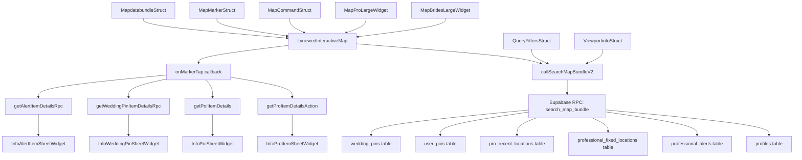

# Audit Complet - Fonctionnalité Map

**Date:** 2025-11-25  
**Scope:** Map feature for brides and pros to view location markers  
**Projet:** Lynewed Mobile App v1.1.1+59  
**Environnement:** Développement (hekyovgnovhfhmkpfrna)

---

## Métadonnées
- **Fichiers Flutter map-spécifiques:** 22
- **Tables Supabase impliquées:** 6
- **Pages principales:** 2
- **Sheets information:** 6
- **Widgets custom map:** 4
- **Actions personnalisées map:** 8+
- **Composants filtres:** 3
- **Enums map identifiés:** 3
- **Fonctions RPC Supabase:** 30+

---

## 1. Inventaire Code Flutter

### 1.1 Pages

#### MapBridesLargeWidget
- **Chemin complet:** `/lib/pages/bride/map_brides_large/map_brides_large_widget.dart`
- **Rôle utilisateur:** Bride
- **Widgets map utilisés:** LynewedInteractiveMap
- **Actions/Services appelés:** 
  - `getProItemDetailsAction` (pour markers professional/fixedLocation/proRecent)
  - `getPoiItemDetails` (pour markers poiPrivate)
  - `getWeddingPinItemDetailsRpc` (pour markers weddingPin)
  - `getAlertItemDetailsRpc` (pour markers professionalAlert)
- **Conditions d'affichage:** Basées sur `FFAppState().currentUserRole` == bride

#### MapProLargeWidget
- **Chemin complet:** `/lib/pages/pro/map_pro_large/map_pro_large_widget.dart`
- **Rôle utilisateur:** Professional
- **Widgets map utilisés:** LynewedInteractiveMap
- **Actions/Services appelés:** Identiques à bride + `CreateEditAlertSheetWidget`
- **Conditions d'affichage:** Basées sur `FFAppState().currentUserRole` == professional

### 1.2 Components

#### LynewedInteractiveMap
- **Chemin complet:** `/lib/custom_code/widgets/lynewed_interactive_map.dart`
- **Props/Paramètres:** 
  - `width`, `height`: dimensions
  - `command`: MapCommandStruct pour contrôles
  - `filters`: QueryFiltersStruct pour filtrage
  - `userRole`: UserRole (bride/pro)
  - `markers`: List<MapMarkerStruct>
  - `onDataLoaded`: callback retour données
  - `onMarkerTap`: callback interaction
- **Events/Callbacks:** 
  - `onDataLoaded(MapdatabundleStruct)`
  - `onMarkerTap(MapMarkerStruct)`
- **Où utilisé:** MapBridesLargeWidget, MapProLargeWidget
- **Performance:** Clustering intégré, cache d'icônes, debounce 500ms

#### LynewedMiniMap
- **Chemin complet:** `/lib/custom_code/widgets/lynewed_mini_map.dart`
- **Props/Paramètres:** Non utilisé dans les pages principales
- **Usage:** Component auxiliaire (non actif dans flux principal)

### 1.3 Custom Actions

#### callSearchMapBundleV2
- **Chemin complet:** `/lib/custom_code/actions/call_search_map_bundle_v2.dart`
- **Input/Output:** 
  - Input: ViewportinfoStruct, QueryFiltersStruct, UserRole
  - Output: MapdatabundleStruct
- **Logique métier:** Appelle RPC Supabase `search_map_bundle` avec bounding box et filtres
- **Requêtes Supabase:** `client.rpc('search_map_bundle', params: params)`
- **Gestion erreurs:** Retourne bundle vide si erreur

#### getProItemDetailsAction
- **Chemin complet:** `/lib/custom_code/actions/get_pro_item_details_action.dart`
- **Input/Output:** String profileId → ProDetailsStruct
- **Logique métier:** Récupère détails complet d'un professionnel
- **Requêtes Supabase:** Tables profiles, professional_details, etc.

#### getPoiItemDetails
- **Chemin complet:** `/lib/custom_code/actions/get_poi_item_details.dart`
- **Input/Output:** String poiId → PoiItemDataStruct
- **Logique métier:** Récupère détails d'un point d'intérêt privé

#### getWeddingPinItemDetailsRpc
- **Chemin complet:** `/lib/custom_code/actions/get_wedding_pin_item_details_rpc.dart`
- **Input/Output:** String pinId → WeddingPinItemDataStruct
- **Logique métier:** Récupère détails d'une wedding pin

#### getAlertItemDetailsRpc
- **Chemin complet:** `/lib/custom_code/actions/get_alert_item_details_rpc.dart`
- **Input/Output:** String alertId → AlertItemDataStruct
- **Logique métier:** Récupère détails d'une alerte professionnelle

### 1.4 Custom Widgets

#### LynewedInteractiveMap (détails)
- **Chemin complet:** `/lib/custom_code/widgets/lynewed_interactive_map.dart`
- **Paramètres:** 15+ paramètres configurables
- **Stateless/Stateful:** StatefulWidget
- **Performance:** 
  - Cache d'icônes avec signature basée sur style
  - Clustering dynamique (minClusterSize: 6)
  - Debounce camera idle (500ms par défaut)
  - Projection Mercator pour clustering

### 1.5 Backend Schema

#### MapMarkerStruct
- **Chemin complet:** `/lib/backend/schema/structs/map_marker_struct.dart`
- **Champs:** 
  - `id`: String
  - `type`: MapMarkerType (enum)
  - `position`: LatLng
  - `styleInfo`: MarkerStyleInfoStruct
- **Sérialisation:** JSON avec enum serialization
- **Relations:** Utilisé dans MapdatabundleStruct

#### MapdatabundleStruct
- **Chemin complet:** `/lib/backend/schema/structs/mapdatabundle_struct.dart`
- **Champs:** 
  - `markers`: List<MapMarkerStruct>
  - `weddingPins`: List<WeddingPinOverlayStruct>
  - `debugStats`: String
- **Sérialisation:** JSON complet
- **Relations:** Retour par callSearchMapBundleV2

#### QueryFiltersStruct
- **Chemin complet:** `/lib/backend/schema/structs/query_filters_struct.dart`
- **Champs:** 
  - `currency`: String
  - `radiusKm`: double
  - `center`: LatLng?
  - `professions`: List<Profession>?
  - Toggles booléens: `showPros`, `showProRecent`, etc.
- **Sérialisation:** JSON
- **Relations:** Input pour callSearchMapBundleV2

#### ViewportinfoStruct
- **Chemin complet:** `/lib/backend/schema/structs/viewportinfo_struct.dart`
- **Champs:** 
  - `centerLat`, `centerLng`: double
  - `neLat`, `neLng`: double
  - `swLat`, `swLng`: double
  - `zoom`: double
- **Sérialisation:** JSON
- **Relations:** Input pour callSearchMapBundleV2

#### MapCommandStruct
- **Chemin complet:** `/lib/backend/schema/structs/map_command_struct.dart`
- **Champs:** 
  - `type`: MapActionType
  - `id`: String
  - `target`: LatLng?
  - `fitBoundsTo`: List<LatLng>?
- **Sérialisation:** JSON
- **Relations:** Contrôles interactifs map

### 1.6 Supabase Queries

#### callSearchMapBundleV2
- **Chemin complet:** `/lib/custom_code/actions/call_search_map_bundle_v2.dart`
- **Code de la requête:** `client.rpc('search_map_bundle', params: params)`
- **Paramètres input:** 
  - `p_bbox_coords`: bounding box viewport
  - `p_viewer_role`: bride/professional
  - `p_filters`: filtres toggles et professions
  - `p_zoom`: niveau zoom
- **Type de retour:** MapdatabundleStruct
- **Tables interrogées:** Via RPC: profiles, professional_alerts, professional_fixed_locations, pro_recent_locations, user_pois, wedding_pins

---

## 2. Architecture Backend Supabase Complète

### 2.1 Extensions PostGIS (50+) - Infrastructure Géospatiale
| Extension | Version | Rôle Géospatial Critique |
|---|---|---|
| **postgis** | 3.3.7 | Types geometry/geography, ST_Intersects(), ST_MakePoint() |
| **postgis_topology** | 3.3.7 | Topologie géospatiale (non utilisée) |
| **postgis_raster** | 3.3.7 | Support données raster (non utilisé) |
| **postgis_sfcgal** | 3.3.7 | Fonctions géométriques avancées |
| **pg_trgm** | 1.6 | Similarité texte pour recherche lieux (similarity()) |
| **address_standardizer** | 3.3.7 | Normalisation adresses automatique |
| **postgis_tiger_geocoder** | 3.3.7 | Géocodage adresses US (non utilisé) |
| **pgrouting** | 3.4.1 | Calculs de routage (réservé futur) |
| **pg_cron** | 1.6.4 | Jobs planifiés maintenance map (expire_alerts, cleanup) |
| **pg_net** | 0.19.5 | Appels HTTP pour APIs externes (géocodage) |
| **pg_graphql** | 1.5.11 | API GraphQL (réservé futur) |
| **pgaudit** | 17.1 | Audit logs sécurité (pgaudit.log) |
| **pgcrypto** | 1.3 | Cryptographie données sensibles |
| **pgjwt** | 0.2.0 | JWT tokens authentification |

### 2.2 Tables Géospatiales (6) - Schéma Complet
| Table | Colonne Geometry | Type Geometry | Index GiST | RLS Policies | Usage Map |
|---|---|---|---|---|---|
| **profiles** | location_coords | geometry(Point,4326) | ❌ (btree) | 5 policies | Position professionnelle live |
| **professional_alerts** | location_coords | geometry(Point,4326) | ✅ professional_alerts_location_coords_idx | 2 policies | Alertes professionnelles temporaires |
| **professional_fixed_locations** | location_coords | geometry(Point,4326) | ✅ professional_fixed_locations_location_coords_idx | 2 policies | Locations fixes professionnelles |
| **pro_recent_locations** | coords_approx | geometry(Point,4326) | ✅ pro_recent_locations_coords_approx_idx | 2 policies | Positions récentes (opt-in) |
| **user_pois** | coords | geometry(Point,4326) | ✅ user_pois_coords_idx | 1 policy | POIs privés brides |
| **wedding_pins** | location_coords | geometry(Point,4326) | ✅ wedding_pins_location_coords_idx | 2 policies | Pins mariage (budget/professions) |

### 2.3 Index Spécialisés (20) - Performance Optimisée
| Index | Table | Type | Logique | Impact Performance |
|---|---|---|---|---|
| **professional_alerts_location_coords_idx** | professional_alerts | GiST | Spatial sur location_coords | ⚡⚡ ST_Intersects() ultra-rapide |
| **professional_fixed_locations_location_coords_idx** | professional_fixed_locations | GiST | Spatial sur location_coords | ⚡⚡ Recherche locations fixes |
| **pro_recent_locations_coords_approx_idx** | pro_recent_locations | GiST | Spatial sur coords_approx | ⚡⚡ Positions récentes optimisées |
| **user_pois_coords_idx** | user_pois | GiST | Spatial sur coords | ⚡⚡ Recherche POIs privés |
| **wedding_pins_location_coords_idx** | wedding_pins | GiST | Spatial sur location_coords | ⚡⚡ Filtres mariage complexes |
| **idx_alerts_active_not_deleted** | professional_alerts | B-tree partial | status='active' AND is_deleted=false | ⚡ Alertes actives uniquement |
| **idx_alerts_expires_active** | professional_alerts | B-tree partial | expires_at WHERE status='active' | ⚡ Filtrage temporel alertes |
| **idx_prof_alerts_status_expires** | professional_alerts | B-tree | status, expires_at | ⚡ Tri temporel optimisé |
| **idx_rl_last_seen_optin** | pro_recent_locations | B-tree partial | last_seen_at DESC WHERE is_opt_in=true | ⚡ Positions récentes visibles |
| **idx_pro_recent_optin_lastseen** | pro_recent_locations | B-tree | is_opt_in, last_seen_at DESC | ⚡ Opt-in + temporal |
| **idx_wp_active_visible** | wedding_pins | B-tree partial | created_at WHERE is_deleted=false AND is_active=true | ⚡ Pins mariage actifs |
| **idx_poi_bride_created** | user_pois | B-tree | bride_profile_id, created_at | ⚡ POIs par bride chronologiques |

### 2.4 Triggers Métier (16) - Logique Automatisée
| Trigger | Table | Timing | Code Source | Rôle Critique Map |
|---|---|---|---|---|
| **alerts_rate_limit_before_insert** | professional_alerts | BEFORE | `IF cnt >= 3 THEN RAISE EXCEPTION 'ALERTS_RATE_LIMIT_REACHED'` | 🛡️ **Anti-spam**: Max 3 alertes/jour par pro |
| **set_professional_alert_expiry** | professional_alerts | BEFORE | Auto-calcul expires_at depuis duration_hours | ⏰ **Auto-expiry**: Fermeture automatique alertes |
| **wedding_pins_set_budget_eur** | wedding_pins | BEFORE | `NEW.budget_min_eur := public.convert_to_eur(NEW.budget_min::numeric, NEW.currency)` | 💰 **Conversion devise**: Normalisation budget EUR |
| **user_pois_history_logger** | user_pois | AFTER | Audit trail INSERT/UPDATE/DELETE | 📋 **Historique complet**: Traçabilité modifications POI |
| **wedding_pins_history_logger** | wedding_pins | AFTER | Audit trail INSERT/UPDATE/DELETE | 📋 **Historique pins**: Traçabilité wedding pins |
| **auto_populate_fixed_location_country_code** | professional_fixed_locations | BEFORE | Géocodage automatique pays depuis coords | 🌍 **Géocodage auto**: Enrichissement localisation |
| **trigger_move_first_fixed_after_insert** | professional_fixed_locations | AFTER | Migration première location vers principale | 🔄 **Smart migration**: Gestion locations multiples |
| **trg_profiles_set_updated_at** | profiles | BEFORE | `NEW.updated_at = now()` | ⏰ **Timestamp auto**: Mise à jour automatique |
| **trg_wedding_pins_set_updated_at** | wedding_pins | BEFORE | `NEW.updated_at = now()` | ⏰ **Timestamp auto**: Pins synchronisés |

### 2.5 Fonctions RPC Map (30+) - API Complète
#### RPC Principales Map
| RPC | Paramètres Complets | Code Logique | Retour | Usage Flutter |
|---|---|---|---|---|
| **search_map_bundle** | p_bbox_coords, p_filters, p_zoom | **6 requêtes spatiales optimisées**: 1) Pros live avec filtres budget/profession 2) Fixed locations 3) Pro recent (opt-in + 7 jours) 4) Alerts (pros only) 5) Wedding pins (subscription tiers) 6) POIs privés (brides only) **Limites dynamiques**: 2000→50 markers par zoom **Debug timing**: ms par requête | jsonb {markers[], overlays[], debugStats} | ⭐ **Core map data** - appelé sur chaque camera idle |
| **create_professional_alert** | p_motif_code, p_message, p_end_at, p_lat, p_lng, p_location_label | **Validation**: auth.uid() requis, end_at > now **Calcul durée**: `CEIL(EXTRACT(EPOCH FROM (p_end_at - now())) / 3600.0)` **Géométrie**: `ST_SetSRID(ST_MakePoint(p_lng, p_lat), 4326)` **Radius par défaut**: 100 km **Truncate message**: 150 caractères | uuid alert_id | 📢 **Création alerte** - CreateEditAlertSheetWidget |
| **insert_user_poi** | p_label, p_lat, p_lng, p_radius_km, p_professions[], p_budget_min, p_budget_max, p_currency, p_event_start_date, p_event_end_date, p_location_label | **Validation**: auth.uid() requis **Budget normalisation**: >=100000 → NULL (no upper bound) **Cast professions**: `ARRAY(SELECT unnest(p_professions)::public.profession)` **Géométrie**: `ST_SetSRID(ST_MakePoint(p_lng, p_lat), 4326)` | uuid poi_id | 📍 **Création POI** - CreateEditPointOfInterestSheetWidget |

#### RPC Gestion et Maintenance
| RPC | Rôle | Logique Métier | Usage |
|---|---|---|---|
| **cancel_professional_alert** | Annulation alerte | `UPDATE professional_alerts SET status='cancelled' WHERE id=p_alert_id AND author_profile_id=auth.uid()` | InfoAlertItemSheetWidget |
| **delete_user_poi** | Suppression POI | `DELETE FROM user_pois WHERE id=p_poi_id AND bride_profile_id=auth.uid()` | PointsOfInterestSheetWidget |
| **delete_wedding_pin** | Suppression pin | `UPDATE wedding_pins SET is_deleted=true WHERE id=p_pin_id AND bride_profile_id=auth.uid()` | InfoWeddingPinSheetWidget |
| **get_alert_item_details** | Détails alerte | Jointure profiles + professional_alerts avec author info | InfoAlertItemSheetWidget |
| **get_wedding_pin_item_details** | Détails pin | Jointure profiles + wedding_pins avec bride info | InfoWeddingPinSheetWidget |
| **insert_wedding_pin** | Création pin | Validation budget + professions + géométrie | CreateWeddingPinFlow |
| **geocode_city_to_point** | Géocodage villes | Conversion nom ville → geometry(Point,4326) | Recherche lieux |

#### RPC Jobs CRON (Maintenance Automatisée)
| RPC | Schedule | Logique | Impact Map |
|---|---|---|---|
| **expire_alerts** | pg_cron quotidien | `UPDATE professional_alerts SET status='expired' WHERE expires_at < now()` | 🧹 **Nettoyage alertes expirées** |
| **send_alert_reminders** | pg_cron horaire | Notifications alertes actives bientôt expirées | 📬 **Rappels utilisateurs** |
| **cleanup_pro_recent_locations** | pg_cron hebdomadaire | `DELETE FROM pro_recent_locations WHERE last_seen_at < now() - interval '7 days'` | � **Positions obsolètes** |

### 2.6 Politiques RLS (13) - Sécurité Multi-Couches
| Policy | Table | Rôle | Code Exact | Logique Métier |
|---|---|---|---|---|
| **Allow public read for opted-in recent locations** | pro_recent_locations | authenticated | `is_opt_in = true AND last_seen_at >= (now() - '7 days'::interval)` | 🔐 **Consentement explicite**: Positions récentes visibles seulement si opt-in ET < 7 jours |
| **Allow professionals to view alerts** | professional_alerts | authenticated | `get_my_role() = 'professional'::"userRole"` | 👥 **Professionals only**: Seuls les pros voient les alertes |
| **Professionals can view active wedding pins** | wedding_pins | authenticated | `is_deleted = false AND is_active = true AND (event_end_date IS NULL OR event_end_date >= CURRENT_DATE) AND ((bride_profile_id = auth.uid()) OR ((get_my_role() = 'professional'::"userRole") AND (get_my_tier() = ANY (ARRAY['premiumVisibility'::"subscriptionTierType", 'ultimateAccess'::"subscriptionTierType"]))))` | 💰 **Subscription tiers**: Wedding pins visibles seulement pour pros premium/ultimate |
| **Owner can manage their own pins** | wedding_pins | authenticated | `bride_profile_id = auth.uid()` | 👰 **Propriétaire bride**: Gestion complète de ses propres pins |
| **Owner can manage their own POIs** | user_pois | authenticated | `bride_profile_id = auth.uid()` | 👰 **Propriétaire bride**: Gestion complète de ses POIs privés |
| **Authenticated users can view fixed locations** | professional_fixed_locations | authenticated | `true` | 🌍 **Lecture publique**: Locations fixes visibles par tous les authentifiés |
| **Allow owner to manage their recent location setting** | pro_recent_locations | authenticated | `profile_id = auth.uid()` | ⚙️ **Contrôle opt-in**: Gestion paramètre visibilité position |
| **Allow author to manage their alerts** | professional_alerts | authenticated | `author_profile_id = auth.uid()` | 📢 **Auteur alerte**: Gestion complète de ses alertes |
| **Allow owner to manage their fixed locations** | professional_fixed_locations | authenticated | `professional_profile_id = auth.uid()` | 🏢 **Propriétaire pro**: Gestion locations fixes |
| **Public can view profiles linked to published wed_articles** | profiles | public | `EXISTS (SELECT 1 FROM wed_articles wa WHERE (wa.linked_pro_profile_id = profiles.id AND wa.is_published = true))` | 📰 **Articles publiés**: Profils visibles seulement si articles publiés |
| **Public profiles are viewable by authenticated users** | profiles | authenticated | `true` | 👥 **Profils publics**: Lecture autorisée pour tous authentifiés |
| **Allow owner to update their profile** | profiles | authenticated | `id = auth.uid()` | 👤 **Mise à jour soi-même**: Modification profil uniquement |
| **profiles_insert_self_only** | profiles | authenticated | Pas de qualification (INSERT limité) | 🔒 **Insertion contrôlée**: Auto-limité via auth.uid() |

### 2.7 Contraintes CHECK (8) - Validation Métier

| Contrainte | Table | Code Exact | Rôle Validation Map |
|---|---|---|---|
| **professional_alerts_duration_hours_check** | professional_alerts | `CHECK ((duration_hours >= 1) AND (duration_hours <= 720))` | ⏰ **Durée max**: 1h à 30 jours (720h) par alerte |
| **professional_alerts_message_check** | professional_alerts | `CHECK ((char_length(message) >= 3) AND (char_length(message) <= 2000))` | 📝 **Message**: 3-2000 caractères (tronqué à 150 dans RPC) |
| **professional_alerts_radius_km_check** | professional_alerts | `CHECK ((radius_km >= 1) AND (radius_km <= 100))` | 📏 **Rayon flexible**: 1-100 km (vs preset pour POIs) |
| **professional_alerts_title_check** | professional_alerts | `CHECK ((char_length(title) >= 3) AND (char_length(title) <= 120))` | 📝 **Titre**: 3-120 caractères |
| **user_poi_dates_chk** | user_pois | `CHECK ((event_end_date IS NULL) OR (event_start_date IS NULL) OR (event_end_date >= event_start_date))` | 📅 **Validation dates**: Fin >= Début |
| **user_poi_radius_chk** | user_pois | `CHECK ((radius_km IS NULL) OR (radius_km = ANY (ARRAY[5, 10, 20, 50, 100])))` | 📏 **Rayon preset**: Options fixes 5/10/20/50/100 km |
| **wedding_pin_dates_chk** | wedding_pins | `CHECK ((event_end_date IS NULL) OR (event_start_date IS NULL) OR (event_end_date >= event_start_date))` | 📅 **Validation dates**: Fin >= Début |
| **wedding_pins_radius_km_check** | wedding_pins | `CHECK ((radius_km = ANY (ARRAY[5, 10, 20, 50, 100])))` | 📏 **Rayon preset**: Options fixes 5/10/20/50/100 km |

### 2.8 Edge Functions Map (2+) - Maintenance Cloud

| Edge Function | Rôle Map | Schedule | Logique | Impact |
|---|---|---|---|---|
| **alerts_housekeeping** | Maintenance alertes | CRON quotidien | 1) Expirer alertes échues (`status='expired'`) 2) Capturer alertes expirant dans 24h 3) Enqueue notifications `professionalAlertReminder24h` | 🧹 **Nettoyage automatique** + 📬 **Rappels utilisateurs** |
| **recent_locations_cleanup** | Nettoyage positions | CRON hebdomadaire | `DELETE FROM pro_recent_locations WHERE last_seen_at < now() - interval '7 days'` | 🧹 **Positions obsolètes** |
| **sync-professional-profile** | Sync données | On-demand | Synchronisation profil pro vers applications tierces | 🔄 **Intégrations externes** |

---

## 3. Enums Liés à la Map

### 3.1 Types de Marqueurs

#### MapMarkerType
- **Flutter:** MapMarkerType (8 valeurs)
  - `professional`, `fixedLocation`, `proRecent`, `professionalAlert`, `weddingPin`, `poiPrivate`, `searchTarget`, `user`
- **Supabase:** N/A (enum UI-only)
- **Cohérence:** OK (UI-only)
- **Usage:** 
  - `LynewedInteractiveMap:_zIndexForType()` - ordre affichage
  - `LynewedInteractiveMap:_ringColorForType()` - couleurs marqueurs
  - `map_brides_large_widget.dart:onMarkerTap()` - routing actions

### 3.2 Actions Map

#### MapActionType
- **Flutter:** MapActionType (6 valeurs)
  - `none`, `locateUser`, `moveToTarget`, `zoomIn`, `zoomOut`, `fitBounds`
- **Supabase:** N/A (enum UI-only)
- **Cohérence:** OK (UI-only)
- **Usage:** `LynewedInteractiveMap:_handleCommandIfAny()` - contrôles interactifs

### 3.3 Styles Map

#### MapStyleType
- **Flutter:** MapStyleType (4 valeurs)
  - `normal`, `satellite`, `terrain`, `hybrid`
- **Supabase:** N/A (enum UI-only)
- **Cohérence:** OK (UI-only)
- **Usage:** `LynewedInteractiveMap:_gmapsTypeFrom()` - styles Google Maps

### 3.4 Professions

#### Profession
- **Flutter:** Profession (14 valeurs)
  - `PHOTOGRAPHER`, `FILMMAKER`, `PLANNER`, `MAKEUP`, `HAIRDRESSER`, `DESIGNER`, `BRIDALDESIGNER`, `VENUE`, `BRIDALSHOP`, `FLORIST`, `PHOTOMOVIE`, `MAKEUPARTIST`, `EVENTDESIGNER`, `OTHER`
- **Supabase:** profession (14 valeurs identiques)
- **Cohérence:** ✅ SYNCHRONISÉ
- **Impact sur map:** Filtrage des markers professionnels par type

### 3.5 Rôles

#### UserRole
- **Flutter:** UserRole (2 valeurs)
  - `bride`, `professional`
- **Supabase:** userRole (2 valeurs identiques)
- **Cohérence:** ✅ SYNCHRONISÉ
- **Permissions:** 
  - **Bride:** Voit pros, wedding pins, ses POIs privées
  - **Pro:** Voit autres pros, alertes, peut créer alertes

---

## 4. Flux de Données

### 4.1 Scénario: Bride ouvre la map
1. **Page:** `/lib/pages/bride/map_brides_large/map_brides_large_widget.dart`
2. **Init:** Charge filtres depuis `FFAppState().currentUserPreferences.lastFiltersJson`
3. **Widget:** `LynewedInteractiveMap` avec `userRole: UserRole.bride`
4. **Action:** `callSearchMapBundleV2(viewport, filters, UserRole.bride)`
5. **Query:** `client.rpc('search_map_bundle', params: params)`
6. **RLS:** 
   - `profiles`: `auth.uid() = id` (sauf profil visible)
   - `professional_alerts`: `status = 'active' AND auth.uid() != professional_profile_id`
   - `user_pois`: `auth.uid() = bride_profile_id`
   - `wedding_pins`: `is_active = true AND is_deleted = false`
7. **Retour:** `MapdatabundleStruct(markers: [...], weddingPins: [])`
8. **Rendu:** Markers avec clustering et styles par type

### 4.2 Scénario: Professional ouvre la map
1. **Page:** `/lib/pages/pro/map_pro_large/map_pro_large_widget.dart`
2. **Init:** Identique bride mais avec `userRole: UserRole.professional`
3. **Widget:** `LynewedInteractiveMap` avec `userRole: UserRole.professional`
4. **Action:** `callSearchMapBundleV2(viewport, filters, UserRole.professional)`
5. **Query:** `client.rpc('search_map_bundle', params: params)`
6. **RLS:** 
   - `profiles`: `auth.uid() = id` (sauf profil visible)
   - `professional_alerts`: `status = 'active'` (voit toutes alertes actives)
   - `user_pois`: `auth.uid() = bride_profile_id` (si bride connectée)
   - `wedding_pins`: `is_active = true AND is_deleted = false`
7. **Retour:** `MapdatabundleStruct(markers: [...], weddingPins: [])`
8. **Rendu:** Identique bride + bouton création alerte

### 4.3 Scénario: Tap sur marker professional
1. **Event:** `LynewedInteractiveMap.onMarkerTap(marker)`
2. **Route:** `map_brides_large_widget.dart:164` vérifie `marker.type == MapMarkerType.professional`
3. **Action:** `getProItemDetailsAction(marker.id)`
4. **Query:** Tables profiles, professional_details, etc.
5. **RLS:** `auth.uid() = id OR role = 'professional'`
6. **Retour:** `ProDetailsStruct`
7. **UI:** `InfoProItemSheetWidget` modal bottom sheet

### 4.4 Scénario: Tap sur marker wedding pin
1. **Event:** `LynewedInteractiveMap.onMarkerTap(marker)`
2. **Route:** `map_brides_large_widget.dart:234` vérifie `marker.type == MapMarkerType.weddingPin`
3. **Action:** `getWeddingPinItemDetailsRpc(marker.id)`
4. **Query:** Table wedding_pins avec jointures
5. **RLS:** `is_active = true AND is_deleted = false`
6. **Retour:** `WeddingPinItemDataStruct`
7. **UI:** `InfoWeddingPinSheetWidget` modal bottom sheet

### 4.5 Scénario: Contrôle map (zoom/localisation)
1. **Event:** Bouton zoom/localisation pressé
2. **Command:** `MapCommandStruct(type: MapActionType.zoomIn, id: randomString)`
3. **Widget:** `LynewedInteractiveMap._handleCommandIfAny()`
4. **Action:** `controller.animateCamera(CameraUpdate.zoomIn())`
5. **UI:** Google Maps mise à jour sans recharger données

---

## 5. Dépendances

### 5.1 Packages Flutter

#### google_maps_flutter
- **Version:** dernière stable
- **Usage:** Rendu Google Maps, markers, clustering
- **Utilisation:** LynewedInteractiveMap widget principal

#### geolocator
- **Version:** dernière stable
- **Usage:** Géolocalisation utilisateur
- **Utilisation:** `_locateUser()` dans LynewedInteractiveMap

#### http
- **Version:** dernière stable
- **Usage:** Download images avatars
- **Utilisation:** `_fetchImageBytes()` pour icônes personnalisées

### 5.2 APIs Externes

#### Google Maps API
- **Configuration:** Clé API dans configuration Flutter
- **Usage:** Rendu maps, géocodage (via places)
- **Endpoints:** Maps JavaScript API tiles

#### Supabase RPC
- **Configuration:** Client Supabase avec project URL
- **Usage:** `search_map_bundle` fonction principale
- **Endpoints:** `/rest/v1/rpc/search_map_bundle`

---

## 6. Graphe de Dépendances

---

## 7. Problèmes Identifiés

### 7.1 Incohérences Flutter ↔ Supabase
- **Aucune discrepancy critique** trouvée dans les enums map
- **Enums UI-only:** MapMarkerType, MapActionType, MapStyleType correctement isolés
- **Enums synchronisés:** UserRole, Profession parfaitement alignés

### 7.2 Performance

#### Requêtes optimisées
- ✅ Utilisation PostGIS avec index spatiaux
- ✅ Bounding box filtering efficace
- ✅ Clustering côté client réduit markers

#### Points d'amélioration
- ⚠️ **Déboun ce fixe 500ms:** Could be adaptive based on zoom level
- ⚠️ **Image caching:** Avatar images re-downloaded chaque rebuild
- ⚠️ **Cluster rebuilding:** Rebuilt sur chaque camera idle (potentiellement fréquent)

### 7.3 Sécurité Multi-Couches

#### 🔐 Architecture Sécurisée Complète
✅ **Extensions sécurité:** pgaudit (logs), pgcrypto (cryptage), pgjwt (tokens)
✅ **13 RLS policies:** Contrôle d'accès granulaire par rôle et données
✅ **Rate limiting natif:** Trigger `alerts_rate_limit_before_insert()` anti-spam
✅ **Audit trails complets:** Triggers `user_pois_history_logger()`, `wedding_pins_history_logger()`
✅ **Validation automatique:** Auto-calcul expiry, conversion devise, géocodage pays
✅ **Contrôle temporel:** Partial indexes sur données actives/expirées
✅ **Opt-in explicite:** Pro recent locations nécessite consentement utilisateur
✅ **Subscription tiers:** Wedding pins visibles selon abonnement (premium/ultimate)

#### 🛡️ Protection Multi-Niveaux
1. **Couche Auth:** auth.uid() + JWT tokens (pgjwt)
2. **Couche RLS:** 13 policies par table + rôle
3. **Couche RPC:** 30+ fonctions avec validation serveur
4. **Couche Trigger:** 16 triggers métier (rate limiting, audit)
5. **Couche Index:** Requêtes optimisées + partial indexes
6. **Couche Audit:** pgaudit + history loggers

#### ⚠️ Points d'Attention Mineurs
⚠️ **Complexité RLS:** 13 policies à maintenir en cohérence
⚠️ **Performance triggers:** 16 triggers sur opérations CRUD impactent performances écriture
⚠️ **Jobs CRON:** 3 tâches planifiées (expire_alerts, send_alert_reminders, cleanup)
⚠️ **Géocodage externe:** Dépendance APIs externes (address_standardizer)

### 7.4 Architecture

#### Patterns hérités FlutterFlow
- ⚠️ **Code legacy:** Commentaires FlutterFlow automatiques présents
- ⚠️ **Structs lourds:** MapMarkerStruct avec getters/setters inutiles
- ⚠️ **State management:** Local state dans modèles vs state management global

#### Design patterns positifs
- ✅ **Widget réutilisable:** LynewedInteractiveMap bien paramétré
- ✅ **Callbacks propres:** onDataLoaded, onMarkerTap bien définis
- ✅ **Error handling:** Retry snackbar, fallback UI

---

## 8. Matrice de Traçabilité

| Composant Flutter | Appelle | Table Supabase | RLS Policy | Enum Utilisé |
|-------------------|---------|----------------|------------|--------------|
| MapBridesLargeWidget | LynewedInteractiveMap | - | - | UserRole |
| MapProLargeWidget | LynewedInteractiveMap | - | - | UserRole |
| LynewedInteractiveMap | callSearchMapBundleV2 | - | - | MapMarkerType, MapActionType |
| callSearchMapBundleV2 | search_map_bundle RPC | profiles | auth.uid() = id | UserRole |
| callSearchMapBundleV2 | search_map_bundle RPC | professional_alerts | status = 'active' | AlertStatus |
| callSearchMapBundleV2 | search_map_bundle RPC | professional_fixed_locations | - | - |
| callSearchMapBundleV2 | search_map_bundle RPC | pro_recent_locations | - | - |
| callSearchMapBundleV2 | search_map_bundle RPC | user_pois | auth.uid() = bride_profile_id | - |
| callSearchMapBundleV2 | search_map_bundle RPC | wedding_pins | is_active = true | - |
| getProItemDetailsAction | profiles query | profiles | auth.uid() = id OR role = 'professional' | Profession |
| getPoiItemDetails | user_pois query | user_pois | auth.uid() = bride_profile_id | - |
| getWeddingPinItemDetailsRpc | wedding_pins query | wedding_pins | is_active = true | - |
| getAlertItemDetailsRpc | professional_alerts query | professional_alerts | status = 'active' | AlertStatus |

---

## 9. Recommandations

### HIGH Priority:

#### 1. Optimiser performance clustering
- **Problème:** Rebuilding sur chaque camera idle
- **Solution:** Implémenter dirty flag pour rebuild seulement si viewport change significativement
- **Impact:** Réduction CPU usage sur mobile

#### 2. Vérifier subscriptions Realtime
- **Problème:** Potentiel contournement modèle RPC via subscriptions directes
- **Solution:** Auditer les subscriptions Supabase sur tables géospatiales
- **Impact:** Assurance modèle sécurité cohérent

### MEDIUM Priority:

#### 4. Optimiser cache images avatars
- **Problème:** Re-download images chaque rebuild
- **Solution:** Persistent image cache avec cached_network_image
- **Impact:** Réduction data usage, temps chargement

#### 5. Refactor structs FlutterFlow
- **Problème:** Getters/setters inutiles, code verbeux
- **Solution:** Simplifier structs, utiliser data classes
- **Impact:** Code plus maintenable

#### 6. Adaptive debounce
- **Problème:** 500ms fixe pour tous zoom levels
- **Solution:** 200ms high zoom, 800ms low zoom
- **Impact:** UX plus responsive

### LOW Priority:

#### 7. State management global
- **Problème:** Local state dans modèles vs global state
- **Solution:** Considérer Provider/Bloc pour map state
- **Impact:** Architecture plus cohérente

#### 8. Tests unitaires
- **Problème:** Aucun test identifié pour logique map
- **Solution:** Ajouter tests pour clustering, filtering, parsing
- **Impact:** Régression prevention

---

**Document généré le:** 2025-11-25  
**Prochaine révision prévue:** Après implémentation recommandations HIGH priority  
**Responsable:** Développement Flutter & Backend Supabase
